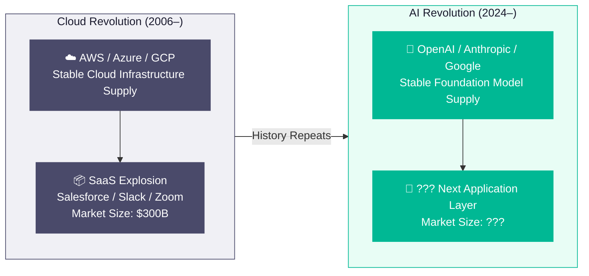
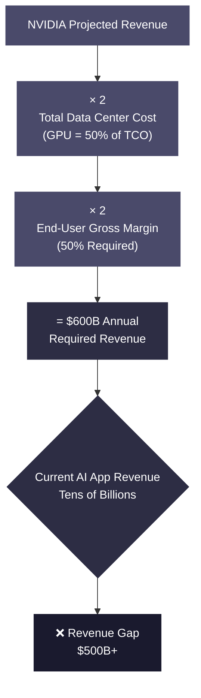
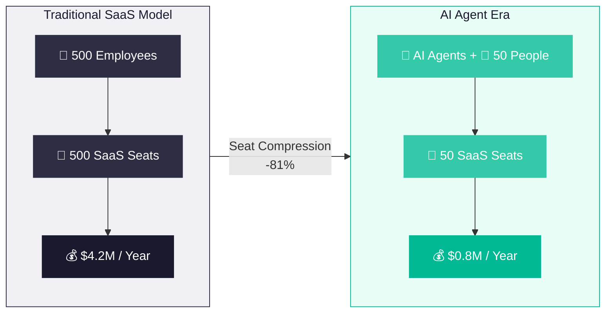
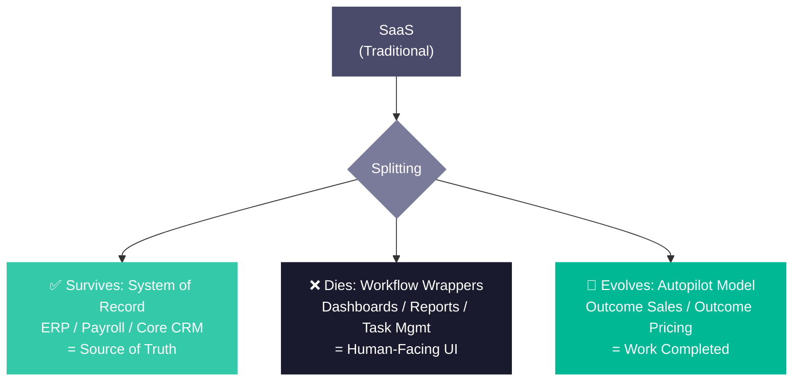
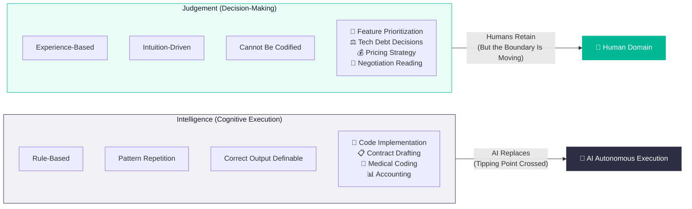
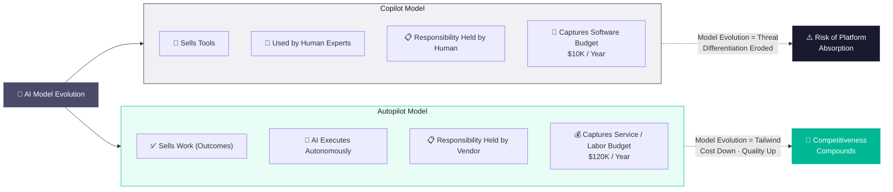
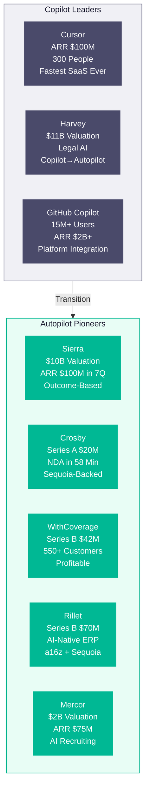
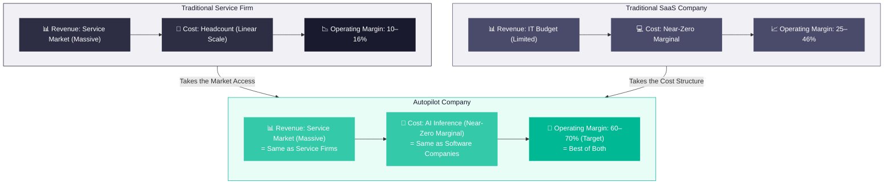
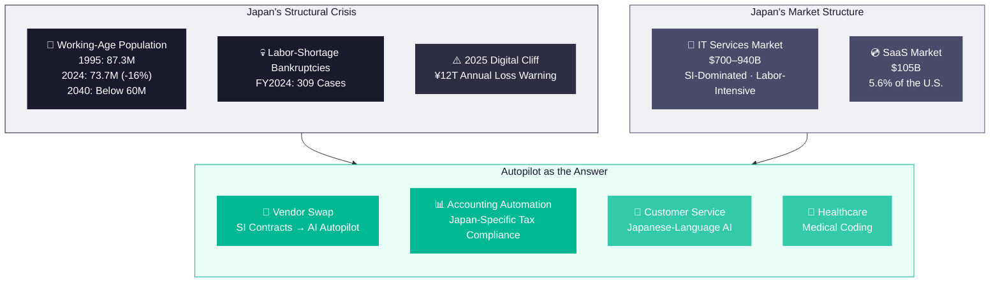

# SaaS Is Dead: The AI Business Model That Will Create the Next $1 Trillion Company

**SaaS Is Dead: The Structural Shift from SaaS to Service-as-a-Software. The Next SaaS Business Model.**

  

 

---

## Chapter 1: The Invariant Law — Infrastructure Revolutions Spawn Application Revolutions

### 1.1 The Recurring Pattern

There is one invariant law in the history of information technology. 
**When a platform-level infrastructure shift occurs, an explosive wave of innovation erupts in the application layer above it.**

This is not a metaphor. It is a structural pattern backed by more than two decades of quantitative evidence.

In 2006, Amazon launched AWS — S3 in March, EC2 in August. 
This triggered one of the most consequential economic cascades in technology history.

| Year | AWS Annual Revenue | YoY Growth |
| ---- | ----------------- | ---------- |
| 2013 | $3.1B | — |
| 2020 | $46.0B | +30% |
| 2024 | $107.6B | +19% |
| 2025 | $128.7B | +20% |
| 2026 (est.) | ~$142.0B | — |

The global public cloud market expanded from under $10 billion in 2006 to $723.4 billion in 2025 (Gartner estimate). 
It is projected to exceed $1 trillion by 2027.

But the cloud infrastructure revolution itself is not what matters. **What it enabled** is what matters.

### 1.2 The "Ownership" Model Cloud Destroyed

Before AWS, enterprise software meant purchasing licenses from Oracle or SAP, deploying them on on-premises servers, and staffing dedicated IT personnel to operate them. 
Massive upfront capital expenditures (CapEx) formed structural barriers to entry, confining advanced software to large enterprises.

Cloud eliminated these barriers. From "ownership" to "usage" — from CapEx to OpEx — the shift democratized access to computing infrastructure. 
Lump-sum purchases gave way to monthly subscriptions. Capacity planning gave way to elastic scaling.

This single structural change gave birth to the SaaS revolution.

### 1.3 The Explosive Growth of SaaS

On the stable, low-cost foundation cloud provided, SaaS (Software as a Service) companies proliferated across every industry and functional domain.

| Year | Global SaaS Market Size | Notes |
| ---- | ---------------------- | ----- |
| 2010 | ~$8.5B | Gartner est. |
| 2015 | ~$31.0B | CAGR ~27% (2010–2015) |
| 2020 | ~$103.0B | CAGR ~27% (2015–2020) |
| 2024 | ~$247.0B | CAGR ~24% (2020–2024) |
| 2025 (forecast) | ~$300.0B | Gartner / SaaStr |

Salesforce, Slack, Zoom, HubSpot, ServiceNow — these companies fundamentally redefined how enterprises buy and consume software. 
The per-seat subscription model produced predictable annual recurring revenue (ARR), high gross margins (~80%), and massive market capitalizations.

| Company | Latest Revenue | Peak Market Cap | Peak Timing |
| ------- | ------------- | -------------- | ----------- |
| Salesforce | $41.5B (FY26) | ~$346.0B | Dec 2024 |
| ServiceNow | $13.3B (TTM) | ~$219.0B | Jan 2025 |
| Zoom | $4.8B (TTM) | ~$139.0B | Oct 2020 |
| HubSpot | $3.1B (2025) | ~$31.5B | Apr 2025 est. |

### 1.4 The Same Pattern Is Repeating — Now with AI

The pattern is unmistakable. **Stable infrastructure supply drives explosive application-layer innovation.**

Today, OpenAI, Anthropic, Google, and Meta are locked in a foundation model development race — the AI equivalent of the cloud infrastructure buildout. 
Hyperscaler capital expenditure on GPU clusters and data centers is proceeding at a scale that dwarfs the AWS/Azure/GCP infrastructure investments of the 2000s.

| Year | Big Tech AI Infrastructure CapEx |
| ---- | ------------------------------- |
| 2022 (actual) | $172.0B |
| 2023 (actual) | $168.0B |
| 2024 (actual) | $256.0B |
| 2025 (forecast) | $427.0B |
| 2026 (forecast) | $527.0–562.0B |

Tomoko Namba, Chairman of DeNA, captured this structure precisely at "DeNA × AI Day 2026" in March 2026:

> "The AI application space is still wide open. The competition in AI has not ended — rather, it is about to begin in a different arena."

Cloud infrastructure gave birth to SaaS. AI infrastructure will give birth to something new. The question is: **What business model wins at the AI application layer?**

### Chapter 1 References

1. Wikipedia, "Amazon Web Services" — https://en.wikipedia.org/wiki/Amazon_Web_Services
2. FourWeekMBA, "AWS Revenues 2013-2025" — https://fourweekmba.com/aws-revenues/
3. XtendedView, "Amazon Statistics 2026" — https://xtendedview.com/amazon-statistics/
4. Gartner, "Worldwide Public Cloud End-User Spending to Total $723 Billion in 2025" — https://www.gartner.com/en/newsroom/press-releases/2024-11-19-gartner-forecasts-worldwide-public-cloud-end-user-spending-to-total-723-billion-dollars-in-2025
5. Statista, "SaaS market size worldwide 2025" — https://www.statista.com/statistics/505243/worldwide-software-as-a-service-revenue/
6. SaaStr / Gartner, "SaaS Spend Accelerating, Will Hit ~$300 Billion in 2025" — https://www.saastr.com/gartner-saas-spend-is-actually-accelerating-will-hit-300-billion-in-2025/
7. Finextra / Gartner, "Worldwide SaaS revenue to surpass $8.5 billion" — https://www.finextra.com/pressarticle/34911/worldwide-saas-revenue-from-enterprise-applications-to-surpass-85-billion---gartner
8. RBC Wealth Management, "Big Tech's AI expansion: From investment to scalable returns" — https://www.rbcwealthmanagement.com/en-us/insights/big-techs-ai-expansion-from-investment-to-scalable-returns
9. JBpress, "DeNA南場会長が示した「アプリケーションAI」の果てしなき可能性" — https://jbpress.ismedia.jp/articles/-/93657

 

---

## Chapter 2: AI's $600 Billion Question — The Revenue Gap Forcing the Next Revolution

### 2.1 The Scale of AI Infrastructure Investment

The numbers are staggering. 
The hyperscalers — Amazon, Alphabet, Microsoft, Meta — are pouring capital into AI infrastructure at a scale that far surpasses the early days of cloud.

| Company | 2025 AI CapEx |
| ------- | ------------- |
| Amazon | $86.0B |
| Microsoft | $80.0B |
| Alphabet | $75.0B |
| Meta | $65.0B |

Goldman Sachs revised its consensus forecast for 2026 hyperscaler CapEx upward to $527 billion.

This is not a technology trend. It is **an economic force demanding returns.**

### 2.2 David Cahn's "$600 Billion Question"

In 2024, Sequoia Capital partner David Cahn published the most widely cited framework for understanding the AI bubble: "AI's $600B Question."

His model is devastatingly simple:

1. Start with NVIDIA's projected revenue (the monopoly GPU supplier)
2. Multiply by 2 (GPUs represent only ~50% of total data center costs — the rest is power, cooling, real estate, backup power)
3. Multiply by 2 again (end users building AI services on this infrastructure need ~50% gross margins)

Conclusion: The AI ecosystem must generate approximately **$600 billion in annual revenue** from the application layer.

### 2.3 The Gap Is Widening

In September 2023, this revenue gap was estimated at $125 billion. 
By the end of 2024, it had ballooned to over $500 billion — driven by intensified competition among hyperscalers and investment races into next-generation chips (NVIDIA B100, etc.).

OpenAI's revenue doubled from $1.6 billion in late 2023 to $3.4 billion in 2024, with estimated ARR reaching $25 billion by early 2026. 
Yet even aggregating all AI company revenues yields only tens of billions of dollars — an order of magnitude short of the required amount.

### 2.4 Why SaaS IT Budgets Cannot Fill the Gap

Here lies the core insight: **Existing enterprise IT budgets — the addressable market of traditional SaaS — cannot mathematically close a $600 billion gap.**

The entire global SaaS market totals approximately $300 billion. 
Even if every dollar of SaaS spending were redirected to AI products, it would cover less than half the required infrastructure returns.

The implication is structural and inescapable: 
**AI applications must expand beyond IT budgets into the labor market, services market, and outsourcing market.** 
Software must stop selling tools and start selling work. 
This is not a strategic choice — it is an economic necessity forced by the scale of infrastructure investment.

### Chapter 2 References

1. Sequoia Capital, David Cahn, "AI's $600B Question" — https://sequoiacap.com/article/ais-600b-question/
2. Goldman Sachs, "Why AI Companies May Invest More than $500 Billion in 2026" — https://www.goldmansachs.com/insights/articles/why-ai-companies-may-invest-more-than-500-billion-in-2026
3. RBC Wealth Management, "Big Tech's AI expansion" — https://www.rbcwealthmanagement.com/en-us/insights/big-techs-ai-expansion-from-investment-to-scalable-returns
4. OpenAI, "Accelerating the next phase of AI" — https://openai.com/index/accelerating-the-next-phase-ai/
5. TECHi, "OpenAI IPO 2026" — https://www.techi.com/openai-ipo/
6. NVIDIA SEC Filing, "FY2025 CFO Commentary" — https://www.sec.gov/Archives/edgar/data/0001045810/000104581025000021/q4fy25cfocommentary.htm

 

---

## Chapter 3: SaaS Is Not Dead — It's Splitting

### 3.1 Nadella's Declaration

In December 2024, Microsoft CEO Satya Nadella appeared on the BG2 podcast and made a statement that sent shockwaves through the software industry:

> "The business applications as we know them today (SaaS) will collapse."

His argument was specific and structural. 
Most SaaS applications are fundamentally CRUD (Create, Read, Update, Delete) operations with business logic layered on top. 
In an agentic AI world, this business logic layer migrates entirely to the AI agent layer. 
AI agents are agnostic to whether the backend is Salesforce, SAP, or a custom database — they update multiple systems via APIs, completing complex workflows without human intervention.

The implication: the elaborate front-end UIs that SaaS companies spent years building become unnecessary artifacts for AI agents.

### 3.2 The SaaS Apocalypse: $2 Trillion Wiped Out

Nadella's prophecy materialized as an actual market crash in February 2026. 
Dubbed the "SaaSpocalypse" or "Software-mageddon," it was triggered by the release of advanced autonomous agents from Anthropic and OpenAI.

| Event | Impact |
| ----- | ------ |
| Software Sector Market Cap Loss | ~$2T wiped out in weeks |
| IGV (Software ETF) | YTD -22% |
| Atlassian | -35% |
| Salesforce | -28% |

The panic had a specific cause: investors understood **seat compression**.

### 3.3 Seat Compression — The Mechanism of Destruction

SaaS valuations have always depended on per-seat licensing. 
More employees = more licenses = more revenue. 
Enterprise headcount growth mechanically drove SaaS revenue growth.

AI agents destroy this equation.

If a single AI agent can handle the work of five people in data entry, task management, and customer support, a company cancels five SaaS seats and retains only one API access for the agent. 
According to Bain & Company's analysis, in environments where agents handle 90% of repetitive work, 500 seats compress to 50 — an 80% reduction.

| Metric | Before AI Agents | After AI Agents |
| ------ | --------------- | --------------- |
| SaaS Seats | 500 | 50 |
| Annual SaaS Spend | $4.2M | ~$0.8M (incl. AI usage) |
| Reduction | — | -81% |

Klarna's case is emblematic. 
The Swedish fintech giant replaced Salesforce and Workday with internally developed AI systems. 
An AI chatbot handled two-thirds of all customer service interactions on its own, delivering $40 million in annual cost savings.

### 3.4 What Survives and What Dies

As IDC Ventures analyst Laura Sánchez-Quiñones points out, the reality is not that SaaS disappears entirely. 
What is happening is a **split**:

**What survives:**
Systems of Record — ERPs, payroll, core CRM databases. 
These possess structural durability because they hold the "single source of truth" that AI agents must access.

**What dies:**
Workflow wrappers — dashboards, reporting tools, simple workflow automation, task management UIs. 
These exist to make data digestible for human operators. 
AI agents do not need digestible UIs. APIs are sufficient.

### 3.5 The SaaS Fatigue Problem

Even before AI agents, enterprises were showing signs of exhaustion. 
The average company operates 106 SaaS applications (down slightly from 112 in 2023), with 53% of companies actively consolidating and reducing overlapping subscriptions. 
Employees context-switch across dozens of interfaces daily, wasting enormous amounts of time navigating between tools that do not communicate with each other.

SaaS unit economics are deteriorating:

| Metric | 2023–2024 | 2024–2025 Trend |
| ------ | --------- | --------------- |
| Customer Acquisition Cost (CAC) | $1.75 per $1 new ARR | Up 14% to $2.00 |
| CAC Payback Period | Median ~18–20 months | Extending to ~23 months |
| Net Revenue Retention (NRR) | 110–120% | Declining to median 101% |
| Revenue Growth (top quartile) | 60% | Decelerating to 50% |

Acquisition costs are rising, payback periods are lengthening, NRR is approaching 100% — meaning expansion from existing customers has nearly stalled. 
The SaaS growth engine is losing steam, and AI agents are poised to compress the very seat counts that engine depends on.

### 3.6 The a16z Counterargument

Not everyone subscribes to the "death" narrative. 
Andreessen Horowitz published a direct rebuttal titled "Good News: AI Will Eat Application Software," arguing that the SaaSpocalypse thesis is wrong. 
Their position: AI will not reduce the amount of software needed but rather increase it — by enabling new use cases and new categories of software that were previously impossible.

In a separate essay, they argued that historical technology shifts have always expanded the total software market rather than shrinking it — each wave of innovation produced more software companies, not fewer.

Gartner's data partially supports this view: SaaS spending remains the largest segment of public cloud spending and continues to grow.

### 3.7 The Integrated View

The most accurate framing is neither "SaaS is dead" nor "SaaS is fine."

**The SaaS pricing model — per-seat subscriptions for tool access — is dying.** 
**The SaaS delivery mechanism — cloud-hosted, API-accessible software — is evolving into something far more powerful.**

The winners will not sell seats. They will sell outcomes. 
This is Sequoia's thesis, and the subject of the next chapter.

### Chapter 3 References

1. Dynatech Consultancy, "SaaS is Gone — Why did Microsoft's CEO Satya Nadella Claim this?" — https://dynatechconsultancy.com/blog/saas-is-gone-why-did-microsofts-ceo-satya-nadella-claim-this
2. Forrester, "SaaS As We Know It Is Dead: How To Survive The SaaS-pocalypse!" — https://www.forrester.com/blogs/saas-as-we-know-it-is-dead-how-to-survive-the-saas-pocalypse/
3. Financial Content / MarketMinute, "The SaaSpocalypse: AI Agent Revolution Triggers Historic 25% Sell-Off" — https://markets.financialcontent.com/stocks/article/marketminute-2026-2-16-the-saaspocalypse-ai-agent-revolution-triggers-historic-25-sell-off-in-software-giants
4. Digital Applied, "The SaaSpocalypse: AI Agents Disrupting Software Industry" — https://www.digitalapplied.com/blog/saaspocalypse-ai-agents-software-industry-analysis
5. Bain & Company, "Why SaaS Stocks Have Dropped—and What It Signals for Software's Next Chapter" — https://www.bain.com/insights/why-saas-stocks-have-dropped-and-what-it-signals-for-softwares-next-chapter/
6. Taskade, "The Great SaaS Unbundling: How AI Agents Break Per-Seat Pricing (2026)" — https://www.taskade.com/blog/great-saas-unbundling
7. IDC Ventures / Medium, "SaaS Isn't Dead. It's Splitting." — https://medium.com/@idcventures/saas-isnt-dead-it-s-splitting-c295ddb0c36b
8. a16z, "Good News: AI Will Eat Application Software" — https://a16z.com/good-news-ai-will-eat-application-software/
9. a16z, "Death of Software? Nah." — https://a16z.com/death-of-software-nah/
10. Vena Solutions, "85 SaaS Statistics, Trends and Benchmarks for 2026" — https://www.venasolutions.com/blog/saas-statistics
11. Benchmarkit, "2025 SaaS Performance Metrics" — https://www.benchmarkit.ai/2025benchmarks
12. Salesforce Ben, "Is Artificial Intelligence Really Killing SaaS — Or Saving It?" — https://www.salesforceben.com/is-artifical-intelligence-really-killing-saas-or-saving-it/
13. CXToday, "Klarna Didn't Replace Salesforce — It Replaced Them With Alternative SaaS Apps" — https://www.cxtoday.com/crm/klarna-didnt-replace-salesforce-it-replaced-them-with-alternative-saas-apps/

 

---

## Chapter 4: Intelligence vs Judgement — What AI Replaces and What Remains Human

### 4.1 Bek's Framework

In March 2026, Sequoia Capital partner Julien Bek published "Services: The New Software" 
— a single essay that became the most important business strategy thesis of the year. Its opening sentence encapsulates the argument:

> "The next $1T company will be a software company masquerading as a services firm."

To understand why, Bek decomposed all human work into two components: 
**Intelligence** and **Judgement**.

> "Writing code is mostly intelligence. Knowing what to build next is judgement."

### 4.2 Intelligence: Rule-Based, Pattern-Driven, Substitutable

In Bek's framework, Intelligence refers to work that, while complex, is fundamentally governed by rules. 
It may require specialized knowledge, but it follows identifiable patterns and has a definable correct output.

Examples:

- Converting specifications into code
- Software testing and debugging
- Formatting legal documents
- Converting medical records into billing codes (ICD-10)
- Processing insurance claims based on policy terms
- Reconciling financial transactions

### 4.3 Judgement: Experience-Based, Intuition-Driven, (Still) Human

Judgement refers to decisions that depend on experience accumulated over years, contextual awareness, and intuition cultivated through practice.

Examples:

- Deciding which feature to build next
- Judging whether to accept technical debt before a launch
- Crafting pricing strategy for a new market
- Navigating a negotiation where the counterparty has hidden motives
- Assessing whether a startup is ready for Series A

### 4.4 Why Software Engineering Fell First

Over 55% of all AI tool usage is concentrated in software engineering — far more than any other professional domain. 
Why?

**Because the vast majority of software engineering work is composed of Intelligence.** 
Code generation, test writing, bug fixing, documentation, code review — all of these follow rules that can be inferred from large codebases.

A year ago, Cursor users employed AI as an autocomplete assistant. 
Today, AI agents initiate tasks before the human does more often than not. 
The shift from "AI helps me write code" to "AI writes code; I review" happened in months, not years.

### 4.5 The 60% Tipping Point

The ARC-AGI-2 benchmark — designed to measure AI's "fluid intelligence" (the ability to adapt to novel situations rather than replaying memorized patterns) — 
crossed the **60% threshold** in Q1 2026, according to a PitchBook analyst report.

This 60% is widely recognized as the tipping point for **direct labor substitution** — 
the level at which AI systems can autonomously complete complex professional tasks at cost-effective price points.

Cost is as important as capability: 
The inference cost to complete complex tasks has dropped to **$1–$10 per task**.

| Model | Cost per 1M Input Tokens | vs GPT-4 Launch |
| ----- | ----------------------- | --------------- |
| GPT-4 (Mar 2023) | $30.00 | 1x |
| GPT-4o mini (2024) | $0.15 | 200x cheaper |
| DeepSeek R1 (2025) | $0.07 | ~430x cheaper |

### 4.6 Today's Judgement Becomes Tomorrow's Intelligence

Bek's most consequential prediction:

> "Today's judgement will become tomorrow's intelligence."

As AI systems process thousands of tasks in a specific domain, they accumulate proprietary data about what constitutes "good judgement" in that domain. 
Over time, the boundary between Intelligence and Judgement shifts — and AI's territory expands.

This creates a compounding data moat. 
The more work the AI system completes, the more Judgement data it accumulates, the more Judgement tasks it can automate, generating still more data. 
This flywheel is the mechanism that makes Autopilot companies structurally superior to Copilot companies over the long term.

### Chapter 4 References

1. Sequoia Capital, Julien Bek, "Services: The New Software" — https://sequoiacap.com/article/services-the-new-software/
2. PitchBook, "Q1 2026 Analyst Note: SaaS Is Dead, Long Live SaS" — https://pitchbook.com/news/reports/q1-2026-pitchbook-analyst-note-saas-is-dead-long-live-sas
3. ARC Prize, "ARC-AGI-2 Technical Report" — https://arcprize.org/blog/arc-agi-2-technical-report
4. ARC Prize, "Leaderboard" — https://arcprize.org/leaderboard
5. TokenCost, "AI Price Index: LLM Costs Dropped 300x" — https://tokencost.app/blog/ai-price-index
6. Menlo Ventures, "2025: The State of Generative AI in the Enterprise" — https://menlovc.com/perspective/2025-the-state-of-generative-ai-in-the-enterprise/
7. Silicon Analysts, "NVIDIA GPU Market Share 2024-2026" — https://siliconanalysts.com/analysis/nvidia-ai-accelerator-market-share-2024-2026

 

## Chapter 5: Copilot vs Autopilot — Selling Tools or Selling Work

### 5.1 Two Models, One Technology, Opposite Futures

Bek's framework classifies AI companies into two fundamentally different business models:

**Copilot:** 
Sells tools. AI enhances the productivity of human experts. The expert retains responsibility for the output. 
Harvey (for law firms), Rogo (for investment banks), Cursor (for developers) operate in this mode.

**Autopilot:** 
Sells work. AI autonomously completes tasks and delivers outcomes directly to the customer. 
Crosby (sells NDA review to businesses, not to law firms), 
WithCoverage (sells insurance management to CFOs, not to insurance brokers), 
Rillet (closes the books rather than assisting the accountant) operate in this mode.

### 5.2 The Decisive Difference: Is Model Evolution Friend or Foe?

> "If you sell the tool, you're in a race against the model."

This is Bek's most important strategic insight.

**For Copilot companies:**
Every improvement in the foundation AI model is a threat. 
Every time Claude or GPT gets better, the Copilot's differentiation erodes. 
The tool risks being downgraded to a built-in platform feature. 
Cursor must constantly innovate faster than the AI models improve.

**For Autopilot companies:**
Every improvement in the foundation AI model is a tailwind. 
Every time Claude or GPT gets better, the Autopilot's service becomes faster, cheaper, and higher quality. 
The cost of delivering work falls; quality rises. 
Model evolution is not a headwind but a tailwind.

### 5.3 The $1-to-$6 Ratio

The market size difference is not incremental — it is an order of magnitude.

> "For every dollar spent on software, six are spent on services."

Bek's example is vivid: 
A company pays $10,000 a year for QuickBooks and $120,000 a year for an accountant to close the books. 
Traditional SaaS companies fight over the $10,000 wallet. 
Autopilot companies target the $120,000 wallet.

| Budget Category | Typical Annual Spend | Target Model |
| --------------- | -------------------- | ------------ |
| Accounting Software (SaaS) | $10,000 | Copilot |
| Accountant Salary / Outsourcing | $120,000 | Autopilot |
| Ratio | 1 : 12 | — |

Foundation Capital estimates the total addressable market for AI Autopilot companies at **$4.6 trillion** — 
encompassing outsourcing, professional services, and substitutable labor costs.

### 5.4 The Copilot Trap

The structural risk Bek identifies for Copilot companies: 
as AI models improve, the space between "a tool that helps experts" and "a built-in platform feature" narrows.

GitHub Copilot illustrates this. 
It launched as a standalone product, rapidly became standard equipment for developer tools, and is now being directly integrated into IDEs and platforms. 
The $10/month standalone price creates value, but that value accrues to the platform (GitHub/Microsoft), not to the tool category.

### 5.5 The Transition Zone

Copilot is the starting point; Autopilot is the destination. 
Many companies start as Copilots and evolve. Harvey began as a legal search and summarization tool (Copilot), 
and is incrementally transitioning toward an Autopilot that automates entire workflows — from case research to first-draft contracts.

The key metric for evaluating transition potential: 
**Does the AI system possess Judgement data that compounds over time?** 
If yes, the company is building the data moat required to move from "helping experts" to "replacing experts' routine work."

### Chapter 5 References

1. Sequoia Capital, Julien Bek, "Services: The New Software" — https://sequoiacap.com/article/services-the-new-software/
2. Contrary Research, "Cursor Business Breakdown" — https://research.contrary.com/company/cursor
3. Spearhead, "Cursor by Anysphere: Fastest Growing SaaS" — https://www.spearhead.so/blogs/cursor-by-anysphere-the-fastest-growing-saas-product-ever
4. MLQ, "GitHub Copilot Surpasses 20M All-Time Users" — https://mlq.ai/news/github-copilot-surpasses-20-million-all-time-users-accelerates-enterprise-adoption/
5. CIO Dive, "GitHub Copilot drives revenue growth" — https://www.ciodive.com/news/github-copilot-subscriber-count-revenue-growth/706201/

 

---

## Chapter 6: The Pioneers — Autopilot Companies Redesigning Industries

### 6.1 The First Wave

A new category of company is emerging — one that sells completed work, not access to tools. 
From the outside, they look like service firms. On the inside, they run on AI.

### 6.2 Copilot Leaders (Transition Candidates)

**Cursor** — 
The fastest-growing company in SaaS history. 
An AI-native code editor that reached $100M ARR with approximately 300 employees. It represents the apex of the Copilot model: 
developers write code 2–3x faster with Cursor's AI assistance. 
But Cursor faces Bek's "race against the model" — improvements in Claude and GPT make sustaining differentiation increasingly difficult. 
Survival hinges on transitioning from Copilot to Autopilot — from "a tool that helps developers write code" to "a system where AI writes code and developers review."

**Harvey** — 
Emerged as an AI legal research and summarization tool for elite law firms. 
It has incrementally automated associate-level workflows, from case law research to first-draft contract generation. 
As of March 2026, valued at $11 billion, with reports of an additional $200M raise led by Sequoia under discussion. 
Harvey's trajectory is a textbook Copilot-to-Autopilot case: starting by assisting lawyers, moving toward replacing the work that junior associates perform. 
Proprietary legal reasoning data accumulated from thousands of hours of lawyer-AI interactions forms a compounding moat.

**GitHub Copilot** — 
The category-defining product. 
Over 15 million users, generating $2B+ in ARR for Microsoft. 
88% of developers report productivity gains; 96% report faster completion of repetitive tasks. 
However, GitHub Copilot also illustrates platform absorption risk: 
integration into VS Code and GitHub is progressing, and its standing as a standalone product category is relatively declining.

### 6.3 Autopilot Pioneers (New Category Creators)

**Sierra** — 
The definitive Autopilot company in customer support, founded by Bret Taylor, former co-CEO of Salesforce. 
Sierra does not make human agents respond faster — it autonomously handles entire customer interactions, 
from understanding the inquiry to operating backend systems (returns, refunds, account changes). 
It reached $100M ARR in just 7 quarters — among the fastest in enterprise software history. 
Raised $350M at a $10 billion valuation in September 2025. 
Outcome-based pricing model: charges per resolved interaction, not per seat or API call. 
Versus human operator cost of ~$15 per interaction, Sierra's AI resolves at $3–5 — the customer saves on costs; Sierra captures margin.

**Crosby** — 
Not a legal tool, but an AI-native law firm. 
Completes NDA and MSA reviews in under 58 minutes — work that traditionally took days. 
Series A with Sequoia participation ($20M from Index Ventures and BCV). 
Sells directly to businesses, bypassing law firms entirely. 
Targets the legal outsourcing budget, not the legal software budget. 
A textbook example of Bek's "vendor swap": replacing outside counsel contracts with AI services.

**WithCoverage** — 
Replaces traditional insurance brokers. 
Delivers AI-driven risk management and insurance procurement directly to CFOs, eliminating the broker as intermediary. 
Series B of $42M, 550+ customers, reportedly operating profitably. 
Flat-fee pricing rather than commission-based — eliminating the conflict-of-interest structure inherent in traditional brokerage. 
Targets the insurance outsourcing market (~$140–200B) through pure vendor swap.

**Rillet** — 
An AI-native ERP that closes the books instead of assisting the accountant. 
Automatically processes complex B2B SaaS subscription contracts, performs ASC 606-compliant revenue recognition, reconciles multi-currency transactions, and generates audit-ready financial statements. 
Series A ($25M from Sequoia) followed by Series B ($70M from Andreessen Horowitz and ICONIQ). 
Targets not the $10,000 a company pays for QuickBooks, but the $120,000+ it pays to accountants and external accounting firms.

**Mercor** — 
An AI-driven recruiting platform, founded by a 21-year-old. 
Automates candidate sourcing, screening, and matching — the Intelligence-heavy work at the top of the hiring funnel. 
Raised $100M at a $2 billion valuation in February 2025, with reported ARR of $75M. 
Targets the recruiting and talent market ($200B+), replacing headhunter fees with AI-completed candidate pipelines.

### 6.4 What the Pioneers Share

Every successful Autopilot company shares four structural characteristics:

1. **They sell outcomes, not access.** 
Pricing is tied to completed work (resolved tickets, reviewed contracts, closed books, hired candidates). 
Not seats. Not API calls.

2. **They target outsourcing budgets first.** 
Initial go-to-market leverages "vendor swaps" — replacing existing outsourcing contracts, not eliminating internal employees. 
This minimizes organizational friction.

3. **They integrate deeply with Systems of Record.** 
Rather than building dashboards on top of data, they read from and write to the core systems (ERPs, CRMs, HRIS) that define a company's "operational truth."

4. **They accumulate Judgement data.** 
Every completed task generates data about what constitutes "good work" in that domain. 
This data compounds over time, creating a moat that pure technology companies cannot replicate.

### Chapter 6 References

1. Contrary Research, "Cursor Business Breakdown" — https://research.contrary.com/company/cursor
2. TechCrunch, "Cursor's Anysphere nabs $9.9B valuation" — https://techcrunch.com/2025/06/05/cursors-anysphere-nabs-9-9b-valuation-soars-past-500m-arr/
3. CNBC, "Harvey valued at $11B" — https://www.cnbc.com/2026/03/25/legal-ai-startup-harvey-raises-200-million-at-11-billion-valuation.html
4. Harvey Blog, "Harvey Raises at $11B Valuation" — https://www.harvey.ai/blog/harvey-raises-at-dollar11-billion-valuation-to-scale-agents-across-law-firms-and-enterprises
5. Sacra, "Sierra revenue, valuation & funding" — https://sacra.com/c/sierra/
6. CMS Wire, "Sierra AI's $10B Valuation Marks a Turning Point" — https://www.cmswire.com/customer-experience/sierra-ais-10b-valuation-marks-a-turning-point-for-conversational-ai/
7. Sierra, "Outcome-based pricing for AI Agents" — https://sierra.ai/blog/outcome-based-pricing-for-ai-agents
8. Upstarts Media, "Crosby raises $20 Million" — https://www.upstartsmedia.com/p/crosby-ai-law-firm-raises-20-million
9. InsurTech Analyst, "WithCoverage bags $42m Series B" — https://insurtechanalyst.com/2026/01/14/ai-insurtech-withcoverage-bags-42m-series-b-funding/
10. PR Newswire, "Rillet Raises $25M Series A from Sequoia Capital" — https://www.prnewswire.com/news-releases/rillet-raises-25m-series-a-from-sequoia-capital-to-bring-ai-to-mid-market-accounting-302467399.html
11. Rillet Blog, "Rillet Raises $70M Series B from a16z and ICONIQ" — https://www.rillet.com/blog/rillet-raises-70m-series-b-from-andreessen-horowitz-and-iconiq
12. TechCrunch, "Mercor raises $100M at $2B valuation" — https://techcrunch.com/2025/02/20/mercor-an-ai-recruiting-startup-founded-by-21-year-olds-raises-100m-at-2b-valuation/

 

---

## Chapter 7: Outsourcing as the Wedge — Where Autopilot Attacks First

### 7.1 Why Outsourcing Is the Entry Point

Replacing an outsourcing contract is a **vendor swap**. 
Replacing an employee is an **organizational restructuring**.

This distinction, which Bek emphasizes, explains why Autopilot companies uniformly start with outsourced work rather than internal headcount. 
Three conditions make outsourcing the optimal beachhead:

**First:** 
The company has already accepted that the work is performed externally. There is no psychological barrier to overcome.

**Second:** 
A budget line item already exists. There is no need to create a new budget category or secure new executive approval. 
The CFO already has line items for "outside counsel fees," "BPO services," or "contract staffing."

**Third:** 
The buyer already purchases outcomes. 
When a company hires a law firm, it pays for completed contracts — not for the hours an associate spent reading case law. 
This outcome-oriented purchasing habit maps directly onto the Autopilot model.

### 7.2 The Opportunity Map

Sequoia's analysis identifies seven priority sectors where outsourcing is already the norm and Intelligence-heavy work dominates. 
Combined addressable market: over $2.5 trillion.

| Target Industry | Labor Market TAM | Vulnerability |
| -------------- | --------------- | ------------- |
| **Recruiting & Talent** | $200B+ | Resume screening, candidate matching, initial sourcing are pure Intelligence tasks. A fragmented market with thousands of agencies. |
| **Supply Chain & Procurement** | $200B+ | Price negotiation with long-tail suppliers, contract management, RFP processing. AI agents can negotiate simultaneously with thousands of suppliers in multiple languages. |
| **Insurance Brokerage & Claims** | $140–200B | Policy comparison, form completion, initial claims assessment. Highly standardized, rule-based Intelligence work spread across a fragmented small-broker market. |
| **IT Managed Services** | $100B+ | Server monitoring, security patching, access provisioning, alert triage. Repetitive IT operations processes that AI agents handle 24/7 without fatigue. |
| **Accounting, Audit & Tax** | $80–115B | 75% of CPAs in the U.S. approaching retirement. Multi-currency processing, revenue recognition (ASC 606), tax filing. AI-native ERPs compress weekly tasks to hours. |
| **Healthcare Revenue Cycle** | $50–80B | Medical coding — converting clinical records into ~70,000 ICD-10 billing codes. Highly specialized but fundamentally rule-based Intelligence work. |
| **Legal Transactions** | $20–25B | Due diligence, NDA drafting, regulatory filings. Requires high precision but domain-specific agents can replace associate-level work. |

Foundation Capital's broader estimate puts the total TAM for AI Autopilot at **$4.6 trillion** — 
encompassing outsourcing, professional services, and all substitutable labor costs.

```mermaid
flowchart LR
    subgraph TAM["Target Market Size"]
        direction TB
        T1["Recruiting & Talent\n$200B+"]
        T2["Supply Chain\n$200B+"]
        T3["Insurance\n$140–200B"]
        T4["IT Services\n$100B+"]
        T5["Accounting & Audit\n$80–115B"]
        T6["Healthcare\n$50–80B"]
        T7["Legal\n$20–25B"]
    end

    TAM --> TOTAL["Total TAM\n$2.5T+\n(Foundation Capital Est: $4.6T)"]

    TOTAL --> PHASE1["Phase 1: Vendor Swap\nReplace Existing Outsourcing\nOrg Friction = Minimal"]
    PHASE1 --> PHASE2["Phase 2: Budget Expansion\nROI Proven → Internal Intelligence Work\nBudget Envelope Expands"]
    PHASE2 --> PHASE3["Phase 3: Org Redesign\nHumans = Judgement\nAI = Intelligence\nStructural Transformation"]

    style TAM fill:#f0f0f5,stroke:#4a4a6a,color:#1a1a2e
    style T1 fill:#4a4a6a,stroke:#4a4a6a,color:#fff
    style T2 fill:#4a4a6a,stroke:#4a4a6a,color:#fff
    style T3 fill:#4a4a6a,stroke:#4a4a6a,color:#fff
    style T4 fill:#4a4a6a,stroke:#4a4a6a,color:#fff
    style T5 fill:#4a4a6a,stroke:#4a4a6a,color:#fff
    style T6 fill:#4a4a6a,stroke:#4a4a6a,color:#fff
    style T7 fill:#4a4a6a,stroke:#4a4a6a,color:#fff
    style TOTAL fill:#2d2d44,stroke:#2d2d44,color:#fff
    style PHASE1 fill:#66dabe,stroke:#66dabe,color:#1a1a2e
    style PHASE2 fill:#33c9a9,stroke:#33c9a9,color:#fff
    style PHASE3 fill:#00b894,stroke:#00b894,color:#fff
```

### 7.3 The Expansion Playbook: Outsourcing → In-Sourcing

The outsourcing wedge is not the endgame — it is the beginning.

As Autopilot companies accumulate operational data and prove reliability through outsourcing replacement, 
they earn the credibility and performance track record needed to address internal labor. 
The progression follows a predictable path:

**Phase 1: Vendor Swap** — 
Replace existing outsourcing contracts. Organizational friction is minimal. Budgets are already allocated.

**Phase 2: Budget Expansion** — 
Demonstrate ROI that justifies extending AI services to Intelligence-heavy activities performed by internal staff.

**Phase 3: Organizational Redesign** — 
Restructure teams to concentrate human talent on Judgement work while AI handles Intelligence work. This is the "organizational restructuring" that outsourcing initially avoided.

Enabling this expansion is Bek's "Judgement Data Flywheel": 
each phase generates data about what constitutes good work, enabling the AI to incrementally take on higher-Judgement tasks.

### Chapter 7 References

1. Sequoia Capital, Julien Bek, "Services: The New Software" — https://sequoiacap.com/article/services-the-new-software/
2. PitchBook, "Q1 2026 Analyst Note: SaaS Is Dead, Long Live SaS" — https://pitchbook.com/news/reports/q1-2026-pitchbook-analyst-note-saas-is-dead-long-live-sas
3. InsurTech Analyst, "WithCoverage bags $42m Series B" — https://insurtechanalyst.com/2026/01/14/ai-insurtech-withcoverage-bags-42m-series-b-funding/
4. Upstarts Media, "Crosby raises $20 Million" — https://www.upstartsmedia.com/p/crosby-ai-law-firm-raises-20-million
5. Rillet Blog, "Rillet Raises $70M Series B" — https://www.rillet.com/blog/rillet-raises-70m-series-b-from-andreessen-horowitz-and-iconiq
6. TechCrunch, "Mercor raises $100M at $2B valuation" — https://techcrunch.com/2025/02/20/mercor-an-ai-recruiting-startup-founded-by-21-year-olds-raises-100m-at-2b-valuation/

 

## Chapter 8: The P/L Revolution — Service Revenue × Software Cost Structure

### 8.1 Why Traditional Models Hit a Structural Ceiling

To understand why Autopilot companies can reach $1 trillion, one must first understand the P/L structures they are about to disrupt.

**Traditional service firms (McKinsey, Accenture, Deloitte):**
Revenue scales linearly with headcount. 
Every additional dollar of revenue requires a proportional addition of personnel. Operating margins are structurally capped:

| Firm | Annual Revenue | Operating Margin |
| ---- | ------------- | ---------------- |
| Accenture | $65.0B+ | 15.6% |
| Deloitte | $67.0B+ | ~10–15% |
| McKinsey | ~$16.0B | ~15–20% (est.) |
| Big Four Average | — | 10–15% |

Even the world's most profitable service firms cannot structurally exceed 20% operating margins, because revenue and labor costs are tightly coupled.

**Traditional SaaS companies:**
Near-zero marginal cost per additional user. ~80% gross margins. 
But the per-seat pricing model limits access to IT budgets:

| Company | Annual Revenue | Operating Margin |
| ------- | ------------- | ---------------- |
| Adobe | $21.5B | 46% |
| Salesforce | $41.5B | 32.5% |
| ServiceNow | $13.3B | 28% |
| SaaS Average (mature) | — | 25–35% |

High margins, but constrained by the total size of enterprise software budgets.

### 8.2 The Autopilot P/L: Best of Both Worlds

Autopilot companies combine the market access of service firms with the cost structure of software companies.

**Revenue side:** 
Customers perceive and purchase the Autopilot's offering as a service. 
They pay for completed work — closed books, resolved tickets, reviewed contracts. 
This means Autopilot companies access **service budgets** (6x the size of software budgets, per Sequoia's estimate).

**Cost side:** 
Work is performed by AI, not humans. 
The marginal cost per additional customer is primarily inference compute — declining at ~10x per year. 
The cost structure resembles software, not services.

> **Service Firm Market Access × Software Company Cost Structure = Operating Margin Leap**

This is the structural equation for $1 trillion.

### 8.3 Outcome-Based Pricing — The New Revenue Model

The pricing innovation that makes the Autopilot economy work is **outcome-based pricing** — 
charging per completed task rather than per seat or per hour.

Sierra AI's model is the clearest example:

- Human customer service operator cost: ~$15 per interaction
- Sierra's AI resolves autonomously: customer pays a $3–5 "resolution fee"
- Customer saves $10+ per interaction
- Sierra's per-resolution gross margin: 60–70%

A perfect incentive alignment emerges: 
the smarter the AI becomes and the higher the resolution rate, the more Sierra earns and the less the customer pays — simultaneously.

### 8.4 The Margin Challenge (For Now)

There is an honest tension within the Autopilot model. 
Current AI company gross margins average around 25% — well below the SaaS benchmark of 75%+. 
The primary pressure point is inference cost: running large language models at scale is expensive.

However, inference costs are declining at approximately 10x per year. 
GPT-4's launch inference cost was $30 per million tokens. GPT-4o mini: $0.15. DeepSeek R1: $0.07. 
If this pace of decline continues, the 60–70% gross margin target becomes achievable within 2–3 years.

### 8.5 The Klarna Lesson

Klarna's experience provides an important caveat. 
The company initially claimed it had fully replaced Salesforce and Workday with AI, saving $40 million annually. 
Subsequent reporting revealed a more nuanced reality: 
Klarna replaced some SaaS tools with alternative SaaS products and supplemented with internal AI — not a pure AI replacement.

This suggests that the full Autopilot vision — AI completely replacing human professional labor — 
remains partly aspirational for most domains. 
The realistic near-term model is **hybrid**: 
AI handles 70–90% of Intelligence work, with human experts providing Judgement oversight. 
The economics work even at hybrid levels — 70% automation still delivers substantial labor cost reductions.

### 8.6 Consulting Is the Leading Indicator

The world's largest consulting firms are already feeling the pressure. 
McKinsey cut 2,000 support staff in 2024. Accenture restructured 19,000 roles. 
EY, KPMG, and PwC have all announced major restructurings.

These firms are investing heavily in AI — 
but the investment is to augment existing labor models, not to replace them.

This is the Innovator's Dilemma playing out in real time. 
Consulting firms cannot deploy AI that eliminates billable hours without cannibalizing their own revenue model. 
Autopilot startups, unencumbered by legacy revenue models, can price on outcomes from day one.

### Chapter 8 References

1. Sequoia Capital, Julien Bek, "Services: The New Software" — https://sequoiacap.com/article/services-the-new-software/
2. Big 4 Accounting Firms, "Deloitte 2024 Revenue" — https://big4accountingfirms.com/the-blog/deloitte-2024-revenue/
3. Going Concern, "KPMG $38.4 Billion in 2024" — https://www.goingconcern.com/kpmg-brings-up-the-rear-for-revenue-season-with-38-4-billion-in-2024/
4. GSquaredCFO, "SaaS Benchmarks 2026" — https://www.gsquaredcfo.com/blog/saas-benchmarks-2026
5. Sierra, "Outcome-based pricing for AI Agents" — https://sierra.ai/blog/outcome-based-pricing-for-ai-agents
6. Lenny's Vault, "Sierra's Outcome-Based Pricing Model — Brett Taylor" — https://lennysvault.com/insights/growth-scaling-tactics/e0d5de29-37ce-4302-84e5-cd2b7f2a25fc
7. Bloomberg, "Klarna Turns From AI to Real Person Customer Service" — https://www.bloomberg.com/news/articles/2025-05-08/klarna-turns-from-ai-to-real-person-customer-service
8. The Logic, "Top consulting firms hit by AI reckoning" — https://thelogic.co/news/ai-consultant-reckoning/
9. Axios, "AI, Trump put pressure on consulting firms" — https://www.axios.com/2025/08/10/ai-trump-deloitte-accenture-consulting

 

---

## Chapter 9: Japan — Where Labor Shortage Makes Autopilot a Survival Imperative

### 9.1 A Different Driver

In the United States, the Autopilot revolution is primarily driven by **cost reduction** — 
replacing expensive professional services with AI to deliver outcomes at lower prices.

In Japan, the driver is fundamentally different: 
**There are not enough people to do the work.**

### 9.2 The Demographic Crisis

Japan's working-age population peaked at 87.3 million in 1995. 
By 2024, it had declined to 73.7 million — a 16% drop. By 2040, it is projected to fall below 60 million. 
This is not a forecast that might miss. 
The people who will be 25 in 2040 have already been born (or not).

In FY2024, 10,144 corporate bankruptcies were recorded in Japan, of which 309 were directly caused by inability to secure workers. 
Companies are going under not because they lack customers or capital, but because there is no one to do the work.

### 9.3 The IT Services Market

Japan's IT services market (system integration, consulting, BPO) is estimated at $700–940 billion — 
dominated by NTT Data, Fujitsu, Hitachi, and the SI (System Integrator) ecosystem. 
These companies operate labor-intensive models where revenue scales with engineer headcount.

Japan's SaaS market stands at approximately $105 billion — 5.6% of the U.S. SaaS market. 
Domestic SaaS leaders (Sansan, freee, MoneyForward) are growing, but remain small compared to global peers.

### 9.4 METI's "2025 Digital Cliff" Warning

The Ministry of Economy, Trade and Industry (METI) issued a formal warning about the "2025 Digital Cliff" — 
projecting annual economic losses of ¥12 trillion ($80B+) if legacy IT systems are not modernized. 
They specifically noted that as existing IT engineers retire, even maintaining aging systems would become impossible.

This is not a cost optimization opportunity. It is a **survival crisis**.

### 9.5 Why Autopilot Is a Survival Imperative for Japan

The Autopilot model addresses Japan's labor shortage more directly than any other AI application framework:

**Outsourcing-heavy structure:** 
Japan's SI industry already operates on an outsourcing model — 
companies delegate IT operations to NTT Data and Fujitsu. 
Replacing these outsourcing contracts with AI Autopilot is a vendor swap, not an organizational restructuring.

**Accounting talent shortage:** 
Japan faces the same CPA retirement crisis as the U.S., compounded by an overall shrinking workforce. 
AI-native accounting systems (the Rillet model) can autonomously handle Japan's unique tax codes, consumption tax, and year-end adjustments.

**Customer service:** 
Japan's prized service quality is threatened by labor shortages. 
Japanese-language AI agents with sophisticated contextual understanding can maintain service standards while reducing headcount requirements.

**Healthcare:** 
Japan's aging society simultaneously increases healthcare demand and decreases the supply of healthcare workers. 
Medical coding, billing, appointment management, and patient communication are all Intelligence-heavy tasks addressable by AI Autopilot.

### 9.6 The White Space

As of April 2026, no Japanese equivalent of Sierra, Crosby, WithCoverage, or Rillet exists. 
No domestic startup has built an Autopilot model targeting Japan's massive outsourcing and labor markets.

This white space represents both risk and opportunity. 
Japan's Autopilot companies will not emerge from the traditional SI ecosystem — 
those companies lack the structural ability to cannibalize their own labor-based revenue models. 
They will come from new entrants who understand both the AI technology stack and the regulatory, cultural, and business requirements unique to the Japanese market.

### 9.7 D&V: Designing 0→1 in Japan

The Depth & Velocity (D&V) methodology — a framework for new business creation in the AI era — provides a practical playbook for building Autopilot companies in the Japanese market. 
D&V's 10:80:10 model (10% first-party information gathering, 80% AI-accelerated hypothesis generation and validation, 10% human Judgement integration) maps directly onto the Intelligence/Judgement decomposition that Sequoia defines.

For Japanese entrepreneurs and corporate innovators, the critical question is not "Should I build an AI tool?" 
It is: **"Which outsourced, Intelligence-heavy work should I fully automate and sell as a completed service?"**

### Chapter 9 References

1. OECD, "Employment Outlook 2025: Japan" — https://www.oecd.org/en/publications/2025/07/oecd-employment-outlook-2025-country-notes_5f33b4c5/japan_fa8fbc74.html
2. The Diplomat, "Japan's Grim Demographic Reality" — https://thediplomat.com/2025/12/japans-grim-demographic-reality/
3. Mordor Intelligence, "Japan IT Services Market" — https://www.mordorintelligence.com/industry-reports/japan-it-services-market
4. Statista, "IT Services - Japan" — https://www.statista.com/outlook/tmo/it-services/japan
5. Grand View Research, "Japan SaaS Market Size & Outlook 2030" — https://www.grandviewresearch.com/horizon/outlook/software-as-a-service-saas-market/japan
6. Tokyo FinTech / Medium, "Japan's 2025 Digital Cliff" — https://medium.com/tokyo-fintech/japans-2025-digital-cliff-48dbb838fb27
7. JETRO, "Japan's Rapidly Growing AI Market" — https://www.jetro.go.jp/en/invest/insights/expert-perspectives/intel.html
8. Introl, "Japan $135B AI Push" — https://introl.com/blog/japan-ai-infrastructure-135-billion-investment-2025
9. GlobeNewswire, "Japan BPaaS Market Projected to Reach $13.60B by 2035" — https://www.globenewswire.com/news-release/2026/01/12/3216533/0/en/Japan-Business-Process-as-a-Service-Market-Projected-to-Reach-US-13-60-Billion-by-2035-Astute-Analytica.html

 

---

## Chapter 10: The $1 Trillion Hypothesis — Conditions, Risks, and the Race Ahead

### 10.1 Sequoia's Six Conditions

Synthesizing Bek's thesis and the evidence assembled throughout this book, the next $1 trillion company must simultaneously satisfy six conditions:

**1. Outcome-based TAM expansion.** 
Sell completed work rather than tool access, thereby accessing labor and service budgets (6x the size of software budgets). 
The addressable market must be measured in hundreds of billions.

**2. Use outsourcing as the entry wedge.** 
Initial go-to-market leverages vendor swaps of existing outsourcing contracts — minimizing adoption friction and exploiting pre-existing budget authority.

**3. Accumulate Judgement data.** 
The business model systematically captures and codifies domain-specific Judgement, building a compounding data moat that deepens with every completed task.

**4. Model evolution as tailwind.** 
Foundation AI model improvements reduce the cost and raise the quality of delivered work rather than eroding differentiation. 
The company benefits from — rather than competes with — foundation model providers.

**5. Hybrid-to-full-automation trajectory.** 
The business is viable in the current hybrid state (AI handles 70–90% of Intelligence work; humans provide Judgement oversight), 
while possessing an architecture that allows automation to expand as models improve.

**6. Regulatory and liability absorption.** 
In high-value services (legal, healthcare, financial), the company acquires relevant licenses, builds compliance infrastructure, 
and accepts accountability for AI-delivered outcomes. This regulatory moat protects against commoditization.

### 10.2 Evaluation Framework

For investors, entrepreneurs, and strategists evaluating Autopilot company candidates:

| Criterion | Evaluation Metric |
| --------- | ----------------- |
| TAM Expansion | Ratio of outsourcing/labor budget to software budget in the target domain |
| Adoption Friction | Number of internal approvals needed for vendor switch; POC-to-production timeline |
| Data Moat | Daily volume of human-in-the-loop correction logs; week-over-week quality improvement rate |
| Model Alignment | Inference cost as a share of gross margin; quality improvement from model updates |
| Scalability | Revenue per employee; declining trend in operations staff ratio |
| Regulatory Moat | Number of regulatory licenses obtained; compliance certification coverage |

### 10.3 Three Structural Tensions

The Autopilot thesis is powerful, but not without risk. 
Three structural tensions will determine the pace and shape of the transition:

**Tension 1: The gross margin gap.** 
Current AI company gross margins average ~25% (vs the SaaS benchmark of ~75%). 
Inference costs must continue declining at ~10x per year. 
If cost reduction stalls, Autopilot unit economics break down.

**Tension 2: The liability question.** 
When AI delivers completed work, who bears responsibility for errors? 
Autopilot companies are accepting liability that traditionally rested with human professionals (and their malpractice insurance). 
Legal and insurance frameworks for AI-delivered professional work are still forming.

**Tension 3: The hybrid reality.** 
Full automation remains aspirational for most professional domains. 
The current reality is hybrid — AI handles routine Intelligence work; humans handle Judgement-intensive exceptions. 
If the ratio stabilizes at 70% automation and fails to progress toward 95%, the economic case for replacing outsourcing contracts weakens.

### 10.4 Gartner's Five-Stage Roadmap

Gartner forecasts the evolution of agentic AI in enterprise applications across five stages:

| Stage | Timeline | Description |
| ----- | -------- | ----------- |
| 1. AI Assistants | End of 2025 | AI assists human tasks within existing apps. Gartner warns of "agent-washing" — relabeling chatbots as agents. |
| 2. Task-Specific Agents | 2026 | Single-domain agents autonomously execute complex tasks end-to-end. Enterprise app integration rises from 5% to 40%. |
| 3. Collaborative Agents | 2027 | Multiple agents with different skills coordinate within data environments to manage more complex business processes. |
| 4. Cross-Functional Agent Ecosystems | 2028 | Networks of specialized agents collaborate autonomously across apps and business units. One-third of UX migrates from native app screens to agentic front-ends. |
| 5. Democratization & New Normal | 2029 | 50%+ of knowledge workers possess skills to create and manage AI agents on-demand for complex tasks. |

By 2035, Gartner projects that agentic AI will directly drive approximately 30% of enterprise application software revenue ($450B+).

### 10.5 Three Scenarios for 2030

**Scenario A: Autopilot Dominance.** 
Inference costs continue their decline. 
Two to three Autopilot companies achieve ARR exceeding $10 billion, selling completed work in major professional domains. 
The consulting industry is fundamentally restructured. Japan's first Autopilot unicorn emerges. 
SaaS companies that fail to transition to outcome-based models see valuations decline 50%+.

**Scenario B: Hybrid Equilibrium.** 
AI automates 70–80% of Intelligence work but struggles with the remaining 20–30% of Judgement-intensive tasks. 
Autopilot companies grow rapidly but settle into a "managed services" model where small human teams oversee AI workflows. 
Consulting firms successfully adapt by retraining staff into Judgement-heavy supervisory roles. 
The transition is real, but slower than the thesis predicts.

**Scenario C: Platform Absorption.** 
Foundation model providers (OpenAI, Anthropic, Google) build industry-specific Autopilot capabilities directly into their platforms, 
capturing the opportunity before vertical startups can establish moats. 
Value accrues to platform companies, not to specialized Autopilot startups. 
This is the Copilot nightmare extended to the Autopilot layer.

### 10.6 The Question That Matters

The "SaaS is dead" debate misses the point. 
The question is not whether SaaS will survive as a delivery mechanism. It will. 
The question is whether **the per-seat tool-access pricing model** will survive as the dominant business model of enterprise software. It will not.

The next $1 trillion company will not get there by selling 10 million seats at $100 per month. 
It will get there by selling completed work — legal reviews, closed books, resolved customer issues, 
hired candidates, managed IT operations — at 70%+ below the price of human-delivered services, with equal or superior quality.

From the outside, that company will look like the world's largest professional services firm. 
But on the inside, it will run on AI — with software economics, software margins, and software scalability.

The $4.6 trillion addressable market of the service industry is the next battleground for software.

**The race has begun.**

### Chapter 10 References

1. Sequoia Capital, Julien Bek, "Services: The New Software" — https://sequoiacap.com/article/services-the-new-software/
2. Gartner, "Gartner Predicts 40% of Enterprise Apps Will Feature Task-Specific AI Agents by 2026" — https://www.gartner.com/en/newsroom/press-releases/2025-08-26-gartner-predicts-40-percent-of-enterprise-apps-will-feature-task-specific-ai-agents-by-2026-up-from-less-than-5-percent-in-2025
3. IDC Ventures / Medium, "SaaS Isn't Dead. It's Splitting." — https://medium.com/@idcventures/saas-isnt-dead-it-s-splitting-c295ddb0c36b
4. PitchBook, "Q1 2026 Analyst Note: SaaS Is Dead, Long Live SaS" — https://pitchbook.com/news/reports/q1-2026-pitchbook-analyst-note-saas-is-dead-long-live-sas
5. Chargebee, "Outcome-Based Pricing in the AI Era" — https://www.chargebee.com/pricing-labs/ai-saas-pricing-outcome-value-models/
6. Product Coalition / Medium, "SaaS 2.0: When the Software Becomes the Worker" — https://medium.productcoalition.com/saas-2-0-when-the-software-becomes-the-worker-49ea07991d47
7. Sequoia Capital, "AI in 2026: A Tale of Two AIs" — https://sequoiacap.com/article/ai-in-2026-the-tale-of-two-ais/

 

---

## Author

**Satoshi Yamauchi**

* **AI Strategist & Business Designer at Sun Asterisk Inc.**
* **Founder / AI Strategist at Leading.AI**
* Over 15 years of cross-disciplinary experience spanning Business, Technology, and Creative. Led 40+ projects as PL/PM at Future Architect (IT consulting), then moved to Recruit for business strategy and new business development. At Sun Asterisk, systematized the "Depth & Velocity" methodology for new business creation powered by generative AI, serving as Business Designer and AI Strategist.
* This project is part of the research by Leading.AI.
* [📒 Read my insights on Note](https://note.com/satoshi_yamauchi)
* [🌐 Visit Leading.AI Official Website](https://www.leading-ai.io/)

---

## Contributing

Issues and Pull Requests are welcome. We welcome contributions including new Autopilot company case studies, updated market data, regulatory developments by country, and typo corrections.

---

## License

This work is licensed under a [Creative Commons Attribution 4.0 International License](https://creativecommons.org/licenses/by/4.0/). 
© 2026 Satoshi Yamauchi / [Leading AI](https://www.leading-ai.io/) — Licensed under CC BY 4.0
