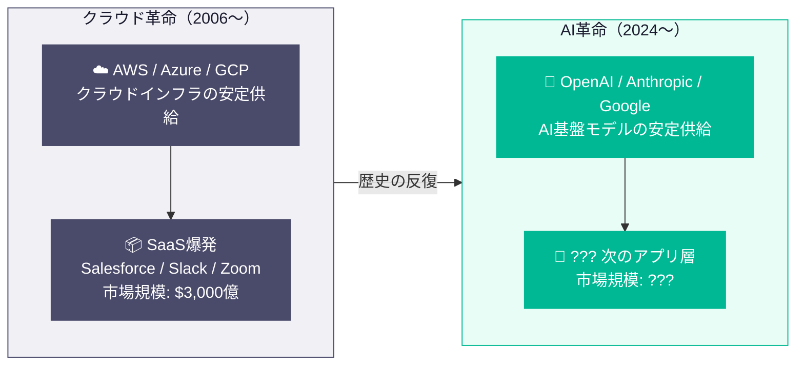
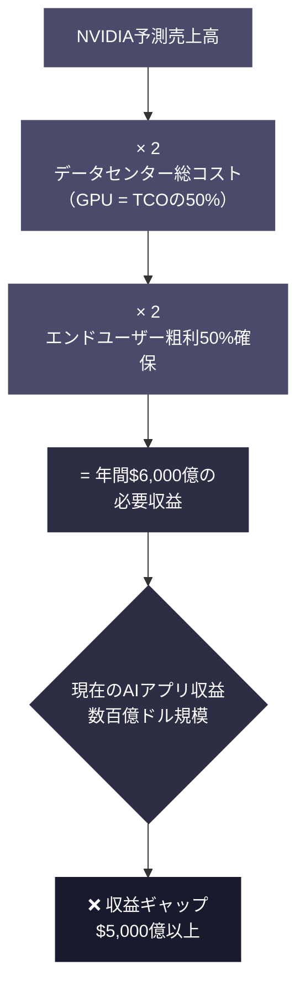
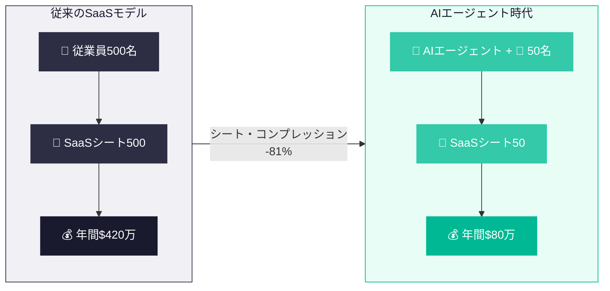
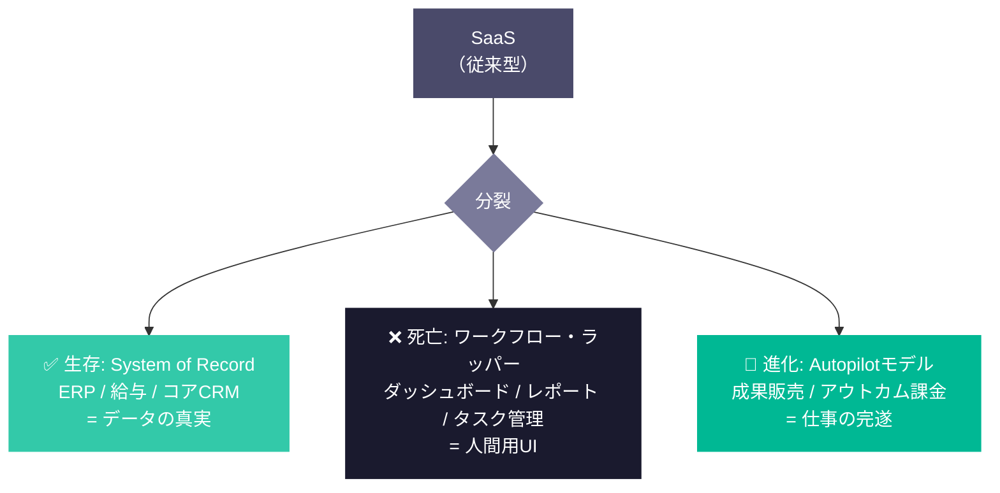
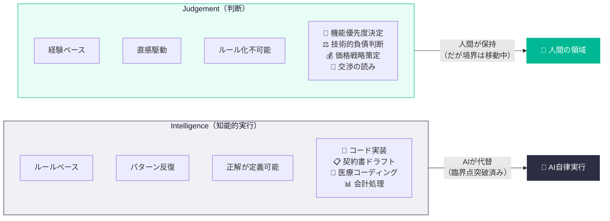
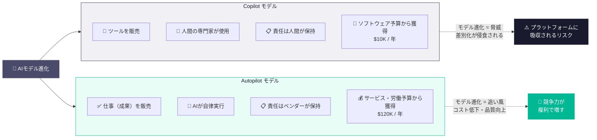
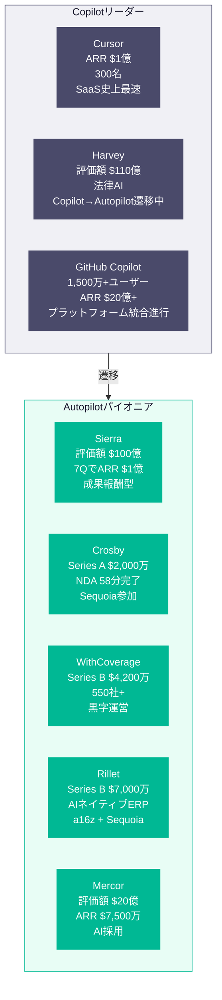
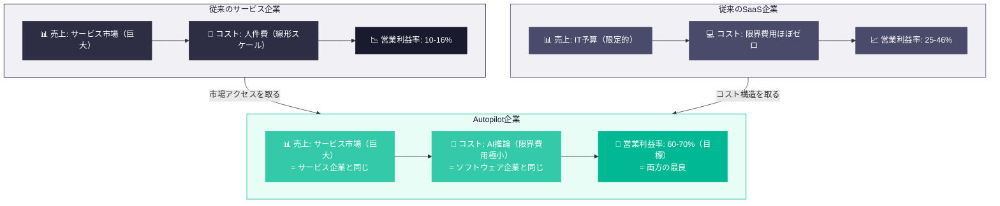
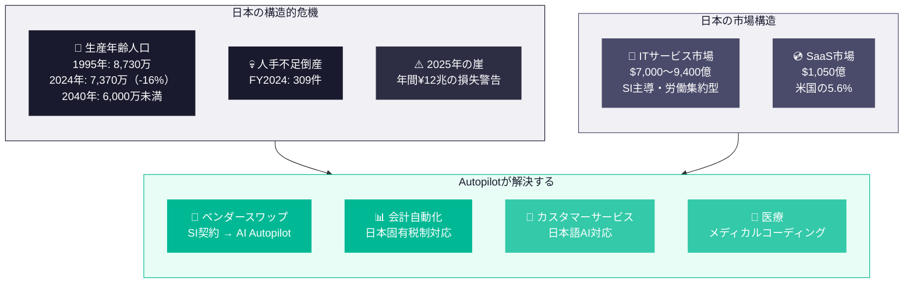

# SaaS Is Dead: The AI Business Model That Will Create the Next $1 Trillion Company

**SaaS Is Dead: SaaSからService-as-a-Softwareへの構造的転換。Next SaaS ビジネスモデル。**

  

 

---

## 第1章: 不変法則 —— インフラ革命がアプリケーション革命を生む

### 1.1 繰り返されるパターン

情報技術の歴史には、1つの不変法則がある。 
**プラットフォームレベルのインフラ転換が起きると、その上のアプリケーション層で爆発的なイノベーションが起きる。**

これは比喩ではない。20年以上にわたる定量的な証拠が裏付ける構造的パターンである。

2006年、AmazonがAWSをローンチした。3月にS3、8月にEC2。 
これが、テクノロジー史上最も重大な経済的カスケードの一つを引き起こした。

| 年         | AWS年間収益  | 前年比成長率 |
| --------- | -------- | ------ |
| 2013年     | $31億     | —      |
| 2020年     | $460億    | +30%   |
| 2024年     | $1,076億  | +19%   |
| 2025年     | $1,287億  | +20%   |
| 2026年（推定） | ~$1,420億 | —      |

グローバルのパブリッククラウド市場全体では、2006年の100億ドル未満から、2025年には$7,234億へと拡大した（Gartner推定）。 
2027年には1兆ドルを超える見通しである。

しかし、クラウドインフラ革命それ自体が本質ではない。**それが何を可能にしたか**が本質である。

### 1.2 クラウドが破壊した「所有」モデル

AWS以前のエンタープライズソフトウェアとは、OracleやSAPからライセンスを購入し、オンプレミスのサーバーに展開し、専任のIT人員を配置して運用することを意味していた。 
巨額の初期投資（CapEx）が構造的な参入障壁を形成し、先進的なソフトウェアを利用できるのは大企業に限られていた。

クラウドはこの障壁を撤廃した。「所有」から「利用」へ——CapExからOpExへの転換は、コンピューティングインフラへのアクセスを民主化した。 
一括購入は月額サブスクリプションに置き換わり、キャパシティプランニングはエラスティックスケーリングに置き換わった。

この単一の構造変化がSaaS革命を生み出した。

### 1.3 SaaSの爆発的成長

クラウドが提供した安定的で低コストな基盤の上に、SaaS（Software as a Service）企業があらゆる業界・機能領域で増殖した。

| 年         | グローバルSaaS市場規模 | 備考                   |
| --------- | ------------- | -------------------- |
| 2010年     | ~$85億         | Gartner推定            |
| 2015年     | ~$310億        | CAGR ~27%（2010-2015） |
| 2020年     | ~$1,030億      | CAGR ~27%（2015-2020） |
| 2024年     | ~$2,470億      | CAGR ~24%（2020-2024） |
| 2025年（予測） | ~$3,000億      | Gartner / SaaStr     |

Salesforce、Slack、Zoom、HubSpot、ServiceNow——これらの企業は、エンタープライズがソフトウェアを購入・消費する方法を根本から再定義した。 
シート単位のサブスクリプションモデルは、予測可能な経常収益（ARR）、高い粗利率（~80%）、そして巨大な時価総額を生み出した。

| 企業         | 直近売上        | ピーク時価総額  | ピーク時期    |
| ---------- | ----------- | -------- | -------- |
| Salesforce | $415億（FY26） | ~$3,460億 | 2024年12月 |
| ServiceNow | $133億（TTM）  | ~$2,190億 | 2025年1月  |
| Zoom       | $48億（TTM）   | ~$1,390億 | 2020年10月 |
| HubSpot    | $31億（2025年） | ~$315億   | 2025年4月頃 |

### 1.4 同じパターンが今、AIで繰り返されている

パターンは明白である。**インフラの安定供給がアプリケーション層の爆発を生む。**

現在、OpenAI、Anthropic、Google、Metaが基盤モデル（Foundation Model）の開発競争を繰り広げている——これはAI版のクラウドインフラ構築競争である。 
GPUクラスタとデータセンターの構築に向けたハイパースケーラーの設備投資は、2000年代のAWS/Azure/GCPのインフラ整備を遥かに上回る規模で進行している。

| 年         | Big TechのAIインフラCapEx |
| --------- | -------------------- |
| 2022年（実績） | $1,720億              |
| 2023年（実績） | $1,680億              |
| 2024年（実績） | $2,560億              |
| 2025年（予測） | $4,270億              |
| 2026年（予測） | $5,270〜5,620億        |

DeNA会長の南場智子氏は2026年3月の「DeNA × AI Day 2026」で、この構造を正確に見抜いている：

> 「AIのアプリケーション領域はまだ空いています。AIの競争はすでに終わったのではなく、むしろ別の場所で始まろうとしている。」

クラウドインフラがSaaSを生んだ。AIインフラは新たな何かを生む。問いは：**AIアプリケーション層で勝つビジネスモデルは何か？**

### 第1章 参考文献

1. Wikipedia, "Amazon Web Services" — https://en.wikipedia.org/wiki/Amazon_Web_Services
2. FourWeekMBA, "AWS Revenues 2013-2025" — https://fourweekmba.com/aws-revenues/
3. XtendedView, "Amazon Statistics 2026" — https://xtendedview.com/amazon-statistics/
4. Gartner, "Worldwide Public Cloud End-User Spending to Total $723 Billion in 2025" — https://www.gartner.com/en/newsroom/press-releases/2024-11-19-gartner-forecasts-worldwide-public-cloud-end-user-spending-to-total-723-billion-dollars-in-2025
5. Statista, "SaaS market size worldwide 2025" — https://www.statista.com/statistics/505243/worldwide-software-as-a-service-revenue/
6. SaaStr / Gartner, "SaaS Spend Accelerating, Will Hit ~$300 Billion in 2025" — https://www.saastr.com/gartner-saas-spend-is-actually-accelerating-will-hit-300-billion-in-2025/
7. Finextra / Gartner, "Worldwide SaaS revenue to surpass $8.5 billion" — https://www.finextra.com/pressarticle/34911/worldwide-saas-revenue-from-enterprise-applications-to-surpass-85-billion---gartner
8. RBC Wealth Management, "Big Tech's AI expansion: From investment to scalable returns" — https://www.rbcwealthmanagement.com/en-us/insights/big-techs-ai-expansion-from-investment-to-scalable-returns
9. JBpress, "DeNA南場会長が示した「アプリケーションAI」の果てしなき可能性" — https://jbpress.ismedia.jp/articles/-/93657

 

---

## 第2章: AIの6,000億ドルの問い —— 次の革命を強制する収益ギャップ

### 2.1 AIインフラ投資の規模

数字は衝撃的だ。 
ハイパースケーラー——Amazon、Alphabet、Microsoft、Meta——がAIインフラに注ぎ込む資本は、クラウド黎明期の投資を遥かに凌ぐ。

| 企業        | 2025年AI CapEx |
| --------- | ------------- |
| Amazon    | $860億         |
| Microsoft | $800億         |
| Alphabet  | $750億         |
| Meta      | $650億         |

Goldman Sachsのレポートでは、2026年のハイパースケーラーCapExのコンセンサス予想が$5,270億に上方修正されている。

これはテクノロジートレンドではない。 **リターンを要求する経済的な力** である。

### 2.2 David Cahnの「6,000億ドルの問い」

2024年、Sequoia Capitalのパートナー David Cahn が、AIバブルを理解するための最も引用されるフレームワークを発表した：「AI's $600B Question」。

彼のモデルは極めて明快である：

1. NVIDIAの予測売上高を出発点とする（GPUの独占的サプライヤー）
2. 2倍にする（GPUはデータセンター総コストの~50%に過ぎない。残りは電力、冷却、不動産、バックアップ電源）
3. さらに2倍にする（このインフラ上でAIサービスを構築するエンドユーザーには~50%の粗利が必要）

結論：AIエコシステム全体で、アプリケーション層から**年間約6,000億ドルの収益**を生み出す必要がある。

### 2.3 ギャップは拡大している

2023年9月時点で、この収益ギャップは$1,250億と推定されていた。 
2024年末には$5,000億超にまで膨張した——ハイパースケーラー間の競争激化と次世代チップ（NVIDIA B100等）への投資競争が原因である。

OpenAIの収益は2023年後半の$16億から2024年には$34億へと倍増し、2026年初頭のARRは推定$250億に達している。 
しかしAI企業全体の収益を合算しても、数百億ドル規模にとどまる——必要額の桁が違う。

### 2.4 なぜSaaSのIT予算ではギャップを埋められないか

ここに核心的な洞察がある：**既存のエンタープライズIT予算——従来のSaaSの対象市場——では、6,000億ドルのギャップを数学的に埋めることが不可能である。**

グローバルのSaaS市場全体が約$3,000億。 
SaaS支出の全額をAI製品に振り替えたとしても、インフラ投資に対する必要リターンの半分にも満たない。

含意は構造的かつ不可避である： 
**AIアプリケーションは、IT予算の枠を超えて、労働市場・サービス市場・アウトソーシング市場へと拡張しなければならない。**  
ソフトウェアはツールを売ることをやめ、仕事を売り始めなければならない。 
これは戦略的選択ではない——インフラ投資の規模が強制する経済的必然である。

### 第2章 参考文献

1. Sequoia Capital, David Cahn, "AI's $600B Question" — https://sequoiacap.com/article/ais-600b-question/
2. Goldman Sachs, "Why AI Companies May Invest More than $500 Billion in 2026" — https://www.goldmansachs.com/insights/articles/why-ai-companies-may-invest-more-than-500-billion-in-2026
3. RBC Wealth Management, "Big Tech's AI expansion" — https://www.rbcwealthmanagement.com/en-us/insights/big-techs-ai-expansion-from-investment-to-scalable-returns
4. OpenAI, "Accelerating the next phase of AI" — https://openai.com/index/accelerating-the-next-phase-ai/
5. TECHi, "OpenAI IPO 2026" — https://www.techi.com/openai-ipo/
6. NVIDIA SEC Filing, "FY2025 CFO Commentary" — https://www.sec.gov/Archives/edgar/data/0001045810/000104581025000021/q4fy25cfocommentary.htm

 

---

## 第3章: SaaSは死んでいない —— 分裂している

### 3.1 Nadellaの宣言

2024年12月、MicrosoftのCEOであるSatya NadellaがポッドキャストBG2に出演し、ソフトウェア業界に衝撃を与える発言をした：

> 「私たちが今日知っているビジネスアプリケーション（SaaS）は崩壊する。」

彼の主張は具体的かつ構造的だった。 
ほとんどのSaaSアプリケーションは、本質的にはCRUD（Create・Read・Update・Delete）操作の上にビジネスロジックを被せたものに過ぎない。 
エージェンティックAIの世界では、このビジネスロジックの層が完全にAIエージェント層に移行する。 
AIエージェントはバックエンドがSalesforceかSAPかカスタムデータベースかを区別せず、APIを介して複数のシステムを横断的に更新し、人間の介入なしに複雑なワークフローを完遂する。

含意：SaaS企業が何年もかけて精巧に作り上げたフロントエンドUIは、AIエージェントにとって不要な産物となる。

### 3.2 SaaSの黙示録：2兆ドルが消失

Nadellaの予言は、2026年2月に現実の市場クラッシュとして具現化した。 
「SaaSpocalypse（SaaSの黙示録）」あるいは「ソフトウェア・マゲドン」と呼ばれるこの事態は、AnthropicとOpenAIから高度な自律型エージェントがリリースされたことを契機に発生した。

| イベント             | 影響         |
| ---------------- | ---------- |
| ソフトウェアセクター時価総額損失 | 数週間で~$2兆消失 |
| IGV（ソフトウェアETF）   | 年初来 -22%   |
| Atlassian        | -35%       |
| Salesforce       | -28%       |

パニックの原因は具体的だった：投資家が**シート・コンプレッション**を理解した。

### 3.3 シート・コンプレッション —— 破壊のメカニズム

SaaSのバリュエーションは常にシート単位のライセンスに依存してきた。 
従業員が増える＝ライセンスが増える＝収益が増える。 
企業のヘッドカウントの増加が、機械的にSaaS収益の成長を駆動していた。

AIエージェントはこの方程式を破壊する。

1つのAIエージェントがデータ入力・タスク管理・顧客対応において5人分の作業をこなせるなら、企業は5人分のSaaSシートを解約し、エージェント用のAPIアクセス権1つだけを残す。 
Bain & Companyの分析によれば、エージェントが反復作業の90%を処理する環境では、500シートが50シートに圧縮される——80%の削減である。

| 指標       | AIエージェント導入前 | AIエージェント導入後    |
| -------- | ----------- | -------------- |
| SaaSシート数 | 500         | 50             |
| 年間SaaS支出 | $420万       | ~$80万（AI利用料含む） |
| 削減率      | —           | -81%           |

Klarnaの事例が象徴的である。 
スウェーデンのフィンテック大手は、社内開発のAIシステムでSalesforceとWorkdayを代替。 
AIチャットボットが全カスタマーサービス対話の3分の2を単独で処理し、年間$4,000万のコスト削減を実現した。

### 3.4 何が生き残り、何が死ぬか

IDC Venturesのアナリスト Laura Sánchez-Quiñones が指摘するように、現実にはSaaSが完全に消滅するわけではない。 
起きているのは **分裂（Splitting）** である：

**生き残るもの：**
System of Record —— ERP、給与計算、コアCRMデータベース。 
AIエージェントがアクセスする「唯一の真実のデータソース」を保持するため、構造的な耐久性を持つ。

**死ぬもの：**
ワークフロー・ラッパー —— ダッシュボード、レポーティングツール、シンプルなワークフロー自動化、タスク管理UI。 
これらはデータを人間のオペレーターが消化しやすくするために存在する。 
AIエージェントは消化しやすいUIを必要としない。APIだけで十分である。

### 3.5 SaaS疲れの問題

AIエージェント以前から、エンタープライズは疲弊の兆候を示していた。 
平均的な企業は106のSaaSアプリケーションを運用しており（2023年の112から微減）、53%の企業が重複するサブスクリプションの統合・削減を実施している。 
従業員は毎日数十のインターフェース間をコンテキストスイッチし、互いに連携しないツール間の移動で膨大な時間を浪費している。

SaaSの基礎的なユニットエコノミクスは悪化している：

| 指標             | 2023〜2024年       | 2024〜2025年のトレンド |
| -------------- | ---------------- | --------------- |
| 新規顧客獲得コスト（CAC） | 新規ARR $1あたり$1.75 | $2.00に+14%上昇    |
| CAC回収期間        | 中央値~18-20ヶ月      | ~23ヶ月に長期化       |
| 純収益維持率（NRR）    | 110-120%         | 中央値101%に低下      |
| 収益成長率（上位四分位）   | 60%              | 50%に減速          |

顧客獲得コストは上昇し、回収期間は延び、NRRは100%に接近——つまり既存顧客からの拡大がほぼ止まっている。 
SaaSの成長エンジンは息切れしており、AIエージェントがそのエンジンが依存するシート数を圧縮しようとしている。

### 3.6 a16zの反論

全員が「死」のナラティブに同意しているわけではない。 
Andreessen Horowitzは「Good News: AI Will Eat Application Software」と題した直接的な反論を発表し、「SaaSpocalypse」の論旨は誤りだと主張した。 
彼らの立場：AIは必要なソフトウェアの量を減らすのではなく、これまで不可能だった新しいユースケースと新しいカテゴリーのソフトウェアを可能にすることで、むしろ増やす。

別の論考では、歴史的なテクノロジーシフトは常にソフトウェア市場全体を縮小ではなく拡大させてきた——各波のイノベーションは、より少ないソフトウェア企業ではなく、より多くのソフトウェア企業を生み出した——と論じている。

GartnerのデータはこのVisionを部分的に裏付ける：SaaS支出はパブリッククラウド支出の最大セグメントであり、成長を続けている。

### 3.7 統合的な見解

最も正確なフレーミングは「SaaSは死んだ」でも「SaaSは大丈夫」でもない。

**SaaSの価格モデル（ツールアクセスに対するシート単位のサブスクリプション）は死にかけている。**  
**SaaSのデリバリーメカニズム（クラウドホステッド、APIアクセス可能なソフトウェア）は、より強力な何かに進化している。**

勝者はシートを売らない。アウトカム（成果）を売る。 
これがSequoiaの論旨であり、次章の主題である。

### 第3章 参考文献

1. Dynatech Consultancy, "SaaS is Gone — Why did Microsoft's CEO Satya Nadella Claim this?" — https://dynatechconsultancy.com/blog/saas-is-gone-why-did-microsofts-ceo-satya-nadella-claim-this
2. Forrester, "SaaS As We Know It Is Dead: How To Survive The SaaS-pocalypse!" — https://www.forrester.com/blogs/saas-as-we-know-it-is-dead-how-to-survive-the-saas-pocalypse/
3. Financial Content / MarketMinute, "The SaaSpocalypse: AI Agent Revolution Triggers Historic 25% Sell-Off" — https://markets.financialcontent.com/stocks/article/marketminute-2026-2-16-the-saaspocalypse-ai-agent-revolution-triggers-historic-25-sell-off-in-software-giants
4. Digital Applied, "The SaaSpocalypse: AI Agents Disrupting Software Industry" — https://www.digitalapplied.com/blog/saaspocalypse-ai-agents-software-industry-analysis
5. Bain & Company, "Why SaaS Stocks Have Dropped—and What It Signals for Software's Next Chapter" — https://www.bain.com/insights/why-saas-stocks-have-dropped-and-what-it-signals-for-softwares-next-chapter/
6. Taskade, "The Great SaaS Unbundling: How AI Agents Break Per-Seat Pricing (2026)" — https://www.taskade.com/blog/great-saas-unbundling
7. IDC Ventures / Medium, "SaaS Isn't Dead. It's Splitting." — https://medium.com/@idcventures/saas-isnt-dead-it-s-splitting-c295ddb0c36b
8. a16z, "Good News: AI Will Eat Application Software" — https://a16z.com/good-news-ai-will-eat-application-software/
9. a16z, "Death of Software? Nah." — https://a16z.com/death-of-software-nah/
10. Vena Solutions, "85 SaaS Statistics, Trends and Benchmarks for 2026" — https://www.venasolutions.com/blog/saas-statistics
11. Benchmarkit, "2025 SaaS Performance Metrics" — https://www.benchmarkit.ai/2025benchmarks
12. Salesforce Ben, "Is Artificial Intelligence Really Killing SaaS — Or Saving It?" — https://www.salesforceben.com/is-artifical-intelligence-really-killing-saas-or-saving-it/
13. CXToday, "Klarna Didn't Replace Salesforce — It Replaced Them With Alternative SaaS Apps" — https://www.cxtoday.com/crm/klarna-didnt-replace-salesforce-it-replaced-them-with-alternative-saas-apps/

 

---

## 第4章: Intelligence vs Judgement —— AIが代替するものと、人間に残るもの

### 4.1 Bekのフレームワーク

2026年3月、Sequoia Capitalのパートナー Julien Bek が「Services: The New Software」を発表した 
——その年で最も重要なビジネス戦略の論考となった一本のエッセイ。冒頭の一文が論旨を凝縮している：

> "The next $1T company will be a software company masquerading as a services firm."
> 「次の1兆ドル企業は、サービス企業に偽装したソフトウェア企業になる。」

なぜそうなるかを理解するために、Bekは全ての人間の仕事を2つの要素に分解した： 
**Intelligence（知能的実行）**と**Judgement（判断）**。

> "Writing code is mostly intelligence. Knowing what to build next is judgement."
> 「コードを書くことはほとんどがintelligenceだ。次に何を作るべきかを知ることがjudgementだ。」

### 4.2 Intelligence: ルールベース、パターン駆動、代替可能

Bekのフレームワークにおいて、Intelligenceとは、複雑ではあるが根本的にルールに支配される仕事を指す。 
専門的な知識を必要とするかもしれないが、識別可能なパターンに従い、定義可能な正しい出力を持つ。

例：

- 仕様書からコードへの変換
- ソフトウェアのテストとデバッグ
- 法務文書のフォーマット整備
- 医療記録から請求コード（ICD-10）への変換
- 保険ポリシー条件に基づくクレーム処理
- 金融取引の照合

### 4.3 Judgement: 経験ベース、直感駆動、（まだ）人間

Judgementとは、年月をかけて蓄積された経験・文脈への認識・実践を通じて培われた直感に依拠する意思決定を指す。

例：

- 次にどの機能を開発すべきかの決定
- ローンチ前に技術的負債を許容すべきかの判断
- 新市場向けの価格戦略の策定
- 相手の隠れた動機がある交渉のナビゲーション
- スタートアップがSeries Aに適しているかの判定

### 4.4 なぜソフトウェアエンジニアリングが最初に陥落したか

全AIツール利用の55%以上がソフトウェアエンジニアリングに集中している——他のどの専門領域よりも遥かに多い。 
なぜか？

**ソフトウェアエンジニアリングの仕事の大部分がIntelligenceで構成されているからだ。**  
コード生成、テスト作成、バグ修正、ドキュメンテーション、コードレビュー——これらは全て、大規模なコードベースから推論できるルールに従っている。

1年前、CursorのユーザーはオートコンプリートのアシスタントとしてAIを使っていた。 
今日では、人間よりもAIエージェントが先にタスクを開始するケースの方が多い。 
「AIが私のコード作成を助ける」から「AIがコードを書き、私がレビューする」への転換は、年単位ではなく月単位で起きた。

### 4.5 60%のティッピングポイント

ARC-AGI-2ベンチマーク——AIの「流動的知性」（暗記したパターンの再現ではなく、未知の状況に適応する能力）を測定するために設計された——が、 
2026年Q1にPitchBookのアナリストレポートによれば**60%の閾値**を突破した。

この60%は、**直接的な労働代替**のティッピングポイントとして広く認識されている—— 
AIシステムが、コスト効率の良い価格帯で、複雑な専門的タスクを自律的に完遂できるレベルである。

コストは能力と同等に重要だ： 
複雑なタスクを完了するための推論コストは、**1タスクあたり$1〜$10**にまで低下している。

| モデル                | 入力100万トークンあたりのコスト | GPT-4ローンチ比 |
| ------------------ | ----------------- | ---------- |
| GPT-4（2023年3月）     | $30.00            | 1x         |
| GPT-4o mini（2024年） | $0.15             | 200倍安い     |
| DeepSeek R1（2025年） | $0.07             | ~430倍安い    |

### 4.6 今日のJudgementは明日のIntelligenceになる

Bekの最も重大な予測がこれだ：

> "Today's judgement will become tomorrow's intelligence."
> 「今日の判断は、明日の知能になる。」

AIシステムが特定のドメインで数千のタスクを処理するにつれて、そのドメインにおける「良い判断とは何か」に関する独自のデータを蓄積していく。 
時間の経過とともに、IntelligenceとJudgementの境界は移動し——AIの領域が拡大する。

これは複利的なデータモートを生み出す。 
AIシステムがより多くの仕事を完了するほど、より多くのJudgementデータが蓄積され、より多くのJudgementタスクを自動化でき、さらに多くのデータが生成される。 
このフライホイールこそが、オートパイロット企業を長期的にコパイロット企業よりも構造的に優位にするメカニズムである。

### 第4章 参考文献

1. Sequoia Capital, Julien Bek, "Services: The New Software" — https://sequoiacap.com/article/services-the-new-software/
2. PitchBook, "Q1 2026 Analyst Note: SaaS Is Dead, Long Live SaS" — https://pitchbook.com/news/reports/q1-2026-pitchbook-analyst-note-saas-is-dead-long-live-sas
3. ARC Prize, "ARC-AGI-2 Technical Report" — https://arcprize.org/blog/arc-agi-2-technical-report
4. ARC Prize, "Leaderboard" — https://arcprize.org/leaderboard
5. TokenCost, "AI Price Index: LLM Costs Dropped 300x" — https://tokencost.app/blog/ai-price-index
6. Menlo Ventures, "2025: The State of Generative AI in the Enterprise" — https://menlovc.com/perspective/2025-the-state-of-generative-ai-in-the-enterprise/
7. Silicon Analysts, "NVIDIA GPU Market Share 2024-2026" — https://siliconanalysts.com/analysis/nvidia-ai-accelerator-market-share-2024-2026

 

## 第5章: Copilot vs Autopilot —— ツールを売るか、仕事を売るか

### 5.1 2つのモデル、1つのテクノロジー、正反対の未来

Bekのフレームワークは、AI企業を根本的に異なる2つのビジネスモデルに分類する：

**Copilot（コパイロット）：**  
ツールを売る。AIは人間の専門家の生産性を向上させる。出力に対する責任は専門家が持つ。 
Harvey（法律事務所向け）、Rogo（投資銀行向け）、Cursor（開発者向け）がこのモードで動いている。

**Autopilot（オートパイロット）：**  
仕事を売る。AIがタスクを自律的に完遂し、成果を直接顧客に納品する。 
Crosby（法律事務所ではなくビジネスにNDAレビューを販売）、 
WithCoverage（保険ブローカーではなくCFOに保険管理を販売）、 
Rillet（会計士を支援するのではなく帳簿を締める）がこのモードで動いている。

### 5.2 決定的な違い：モデル進化は味方か敵か

> "If you sell the tool, you're in a race against the model."
> 「ツールを売っている限り、あなたはモデルとの競争の中にいる。」

これはBekの最も重要な戦略的洞察である。

**Copilot企業にとって：** 
基盤AIモデルの改善は全て脅威である。 
ClaudeやGPTが良くなるたびに、Copilotの差別化は浸食される。 
ツールがプラットフォームの一機能に格下げされるリスクがある。 
CursorはAIモデルの進化速度を上回るイノベーションを常に求められる。

**Autopilot企業にとって：** 
基盤AIモデルの改善は全て追い風である。 
ClaudeやGPTが良くなるたびに、Autopilotのサービスはより速く、より安く、より高品質になる。 
仕事の提供コストが下がり、品質が上がる。 
モデル進化は向かい風ではなく追い風である。

### 5.3 $1対$6の比率

市場規模の差は漸進的ではない—— 桁が違う。

> "For every dollar spent on software, six are spent on services."
> 「ソフトウェアに1ドルを費やすごとに、サービスには6ドルが費やされている。」

Bekの例は鮮烈だ： 
ある企業がQuickBooksに年間$10,000を支払い、会計士に年間$120,000を支払って帳簿を締めている。 
従来のSaaS企業は$10,000のウォレットを取り合っている。 
Autopilot企業は$120,000のウォレットを狙う。

| 予算カテゴリ         | 典型的な年間支出 | 対象モデル     |
| -------------- | -------- | --------- |
| 会計ソフトウェア（SaaS） | $10,000  | Copilot   |
| 会計士の給与・外注費     | $120,000 | Autopilot |
| 比率             | 1 : 12   | —         |

Foundation Capitalの推定では、AIオートパイロット企業の総対象市場は**$4.6兆**—— 
アウトソーシング、プロフェッショナルサービス、AIで代替可能な労働コストの合計である。

### 5.4 Copilotの罠

Bekが特定するCopilot企業の構造的リスク： 
AIモデルが改善するにつれて、「専門家を助けるツール」と「プラットフォームの組み込み機能」の間のスペースが狭まる。

GitHub Copilotがこれを示している。 
スタンドアローン製品として登場し、急速に開発者ツールの標準装備となり、現在はIDEやプラットフォームに直接統合されつつある。 
月額$10のスタンドアローン価格は価値を生み出しているが、その価値はプラットフォーム（GitHub/Microsoft）に帰着し、ツールカテゴリには帰着しない。

### 5.5 遷移ゾーン

Copilotは出発点であり、Autopilotは到達点である。 
多くの企業はCopilotとして始まり、進化する。Harveyは法律検索・要約ツール（Copilot）として始まり、 
ケースリサーチから初稿契約書まで——ワークフロー全体を自動化するAutopilotへと漸進的に移行している。

遷移の鍵となる指標： 
**AIシステムが時間とともに複利的に蓄積するJudgementデータを持っているか？**  
Yesなら、その企業は「専門家を助ける」から「専門家のルーチンワークを代替する」へ移行するために必要なデータモートを構築している。

### 第5章 参考文献

1. Sequoia Capital, Julien Bek, "Services: The New Software" — https://sequoiacap.com/article/services-the-new-software/
2. Contrary Research, "Cursor Business Breakdown" — https://research.contrary.com/company/cursor
3. Spearhead, "Cursor by Anysphere: Fastest Growing SaaS" — https://www.spearhead.so/blogs/cursor-by-anysphere-the-fastest-growing-saas-product-ever
4. MLQ, "GitHub Copilot Surpasses 20M All-Time Users" — https://mlq.ai/news/github-copilot-surpasses-20-million-all-time-users-accelerates-enterprise-adoption/
5. CIO Dive, "GitHub Copilot drives revenue growth" — https://www.ciodive.com/news/github-copilot-subscriber-count-revenue-growth/706201/

 

---

## 第6章: パイオニアたち —— 産業を再設計するAutopilot企業

### 6.1 第一波

新しいカテゴリーの企業が出現している——完成した仕事を売り、ツールへのアクセスを売らない企業だ。 
外から見ればサービス企業に見える。内側はAIで動いている。

### 6.2 Copilotリーダー（遷移候補）

**Cursor** ——  
SaaS史上最速で成長した企業。 
AIネイティブのコードエディターで、約300名の従業員でARR $1億に到達した。Copilotモデルの頂点を代表する： 
開発者はCursorのAI支援により2-3倍速くコードを書く。 
しかしCursorはBekの「モデルとの競争」に直面している——ClaudeやGPTの改善が差別化の維持を困難にする。 
生存はCopilotからAutopilotへの遷移——「開発者がコードを書くのを助けるツール」から、 
「AIがコードを書き開発者がレビューするシステム」への転換——にかかっている。

**Harvey** ——  
エリート法律事務所向けのAI法律リサーチ・要約ツールとして登場。 
判例法リサーチから初稿契約書生成まで、アソシエイトレベルのワークフローを漸進的に自動化してきた。 
2026年3月時点で評価額$110億、Sequoia主導で追加$2億の調達を協議中との報道。 
Harveyの軌跡はCopilot→Autopilotの教科書的事例：弁護士を支援することから始め、ジュニアアソシエイトが行う仕事の代替へと向かっている。 
数千時間の弁護士-AI対話から蓄積された独自の法的推論データが、複利的なモートとなっている。

**GitHub Copilot** ——  
カテゴリーを定義した製品。 
1,500万人以上のユーザー、Microsoftに$20億超のARRを生み出す。 
開発者の88%が生産性向上を報告、96%が反復的タスクの高速化を報告。 
ただしGitHub Copilotはプラットフォーム吸収リスクも示している： 
VS CodeとGitHubの機能として統合が進み、スタンドアローンの製品カテゴリーとしての地位が相対的に低下。

### 6.3 Autopilotパイオニア（新カテゴリー創造者）

**Sierra** ——  
Salesforceの元共同CEOであるBret Taylorが創業した、カスタマーサポートにおける決定的なAutopilot企業。 
Sierraは人間のエージェントの応答を速くするのではなく、顧客対話の全体を自律的に処理する—— 
問い合わせの理解からバックエンドシステム操作（返品・返金・アカウント変更）まで。 
わずか7四半期でARR $1億に到達——エンタープライズソフトウェア史上最速クラス。<be>
2025年9月に$100億の評価額で$3.5億を調達。 
成果報酬型の価格モデル：シートやAPIコールではなく、解決されたインタラクション1件あたりで課金。 
人間のオペレーターコスト$15/件に対し、SierraのAIが$3-5で解決——顧客はコストを削減し、Sierraはマージンを確保。 

**Crosby** ——  
法律ツールではなく、AIネイティブの法律事務所。 
NDAやMSAのレビューを58分未満で完了する——従来は数日を要した仕事だ。 
Sequoia参加のSeries A（Index Ventures、BCVから$2,000万）。 
法律事務所を介さず、ビジネスに直接販売。 
法務ソフトウェア予算ではなく、法務アウトソーシング予算を対象としている。 
Bekの「ベンダースワップ」の実践：外部顧問契約をAIサービスで置き換える。 

**WithCoverage** ——  
従来の保険ブローカーを代替。 
AIによるリスク管理と保険調達をCFOに直接提供し、ブローカーという仲介者を排除。 
Series B $4,200万、550社以上の顧客、利益体質の運営と報告。 
コミッション型ではなく定額課金——従来のブローカレッジに内在する利益相反構造を排除。 
保険アウトソーシング市場（~$1,400〜2,000億の市場）を、純粋なベンダースワップで狙う。

**Rillet** ——  
会計士を支援するのではなく、帳簿を締めるAIネイティブERP。 
複雑なB2B SaaSサブスクリプション契約を自動処理し、ASC 606準拠の収益認識を行い、複数通貨取引を照合し、監査対応可能な財務諸表を生成する。 
Series A（Sequoiaから$2,500万）に続きSeries B（Andreessen HorowitzとICONIQから$7,000万）。 
企業がQuickBooksに支払う$10,000ではなく、会計士や外部会計事務所に支払う$120,000以上を対象とする。

**Mercor** ——  
AI駆動の採用プラットフォーム。21歳の創業者が設立。 
候補者のソーシング、スクリーニング、マッチングを自動化——採用ファネル上部のIntelligence偏重の仕事。 
2025年2月に$20億の評価額で$1億を調達、ARR $7,500万と報道。 
採用・人材市場（$2,000億以上）を対象とし、ヘッドハンター手数料をAI完結型の候補者パイプラインで代替。

### 6.4 パイオニアの共通点

成功しているAutopilot企業は全て、4つの構造的特徴を共有している：

1. **アクセスではなく成果を売る。**  
価格設定は完了した仕事（解決されたチケット、レビューされた契約、締められた帳簿、採用された候補者）に紐づく。 
シートやAPIコールではない。

2. **最初にアウトソーシング予算を狙う。**  
初期のGo-to-Marketは「ベンダースワップ」——既存のアウトソーシング契約の置き換えであり、社内従業員の排除ではない。 
組織的な摩擦を最小化する。

3. **System of Recordと深く統合する。**  
データの上にダッシュボードを構築するのではなく、企業の「運用上の真実」を定義するコアシステム（ERP、CRM、HRIS）に対して読み書きする。

4. **Judgementデータを蓄積する。**  
完了したタスクの一つ一つが、そのドメインにおける「良い仕事とは何か」についてのデータを生成する。 
このデータは時間とともに複利的に蓄積され、純粋なテクノロジー企業には再現できないモートとなる。

### 第6章 参考文献

1. Contrary Research, "Cursor Business Breakdown" — https://research.contrary.com/company/cursor
2. TechCrunch, "Cursor's Anysphere nabs $9.9B valuation" — https://techcrunch.com/2025/06/05/cursors-anysphere-nabs-9-9b-valuation-soars-past-500m-arr/
3. CNBC, "Harvey valued at $11B" — https://www.cnbc.com/2026/03/25/legal-ai-startup-harvey-raises-200-million-at-11-billion-valuation.html
4. Harvey Blog, "Harvey Raises at $11B Valuation" — https://www.harvey.ai/blog/harvey-raises-at-dollar11-billion-valuation-to-scale-agents-across-law-firms-and-enterprises
5. Sacra, "Sierra revenue, valuation & funding" — https://sacra.com/c/sierra/
6. CMS Wire, "Sierra AI's $10B Valuation Marks a Turning Point" — https://www.cmswire.com/customer-experience/sierra-ais-10b-valuation-marks-a-turning-point-for-conversational-ai/
7. Sierra, "Outcome-based pricing for AI Agents" — https://sierra.ai/blog/outcome-based-pricing-for-ai-agents
8. Upstarts Media, "Crosby raises $20 Million" — https://www.upstartsmedia.com/p/crosby-ai-law-firm-raises-20-million
9. InsurTech Analyst, "WithCoverage bags $42m Series B" — https://insurtechanalyst.com/2026/01/14/ai-insurtech-withcoverage-bags-42m-series-b-funding/
10. PR Newswire, "Rillet Raises $25M Series A from Sequoia Capital" — https://www.prnewswire.com/news-releases/rillet-raises-25m-series-a-from-sequoia-capital-to-bring-ai-to-mid-market-accounting-302467399.html
11. Rillet Blog, "Rillet Raises $70M Series B from a16z and ICONIQ" — https://www.rillet.com/blog/rillet-raises-70m-series-b-from-andreessen-horowitz-and-iconiq
12. TechCrunch, "Mercor raises $100M at $2B valuation" — https://techcrunch.com/2025/02/20/mercor-an-ai-recruiting-startup-founded-by-21-year-olds-raises-100m-at-2b-valuation/

 

---

## 第7章: アウトソーシングという楔 —— Autopilotが最初に攻める場所

### 7.1 なぜアウトソーシングがエントリーポイントなのか

アウトソーシング契約の置き換えは**ベンダースワップ**。 
従業員の置き換えは**組織再編**。

Bekが強調するこの区別は、なぜAutopilot企業が一様に社内ヘッドカウントではなくアウトソーシング済みの仕事から始めるかを説明する。 
3つの条件がアウトソーシングを最適な橋頭堡にする：

**第一に：**  
企業はその仕事が外部で実行されることを既に受容している。心理的バリアを超える必要がない。

**第二に：**  
予算項目が既に存在する。新しい予算カテゴリーを作成したり、新たな役員承認を取得する必要がない。 
CFOは既に「外部顧問料」や「BPOサービス」や「派遣人件費」の予算枠を持っている。

**第三に：**  
買い手は既に成果を購入している。 
企業が法律事務所を雇うとき、完了した契約書に対して支払う——アソシエイトが判例を読んだ時間に対してではない。 
この成果指向の購買習慣は、Autopilotモデルに直接マッピングされる。

### 7.2 オポチュニティマップ

Sequoiaの分析は、アウトソーシングが既に常態化しIntelligence偏重の仕事が支配的な7つの優先セクターを特定している。 
合計対象市場は$2.5兆超。

| ターゲット産業          | 労働市場TAM       | 脆弱性の理由                                                                        |
| ---------------- | ------------- | ----------------------------------------------------------------------------- |
| **採用・人材**        | $2,000億以上     | 履歴書スクリーニング、候補者マッチング、初期スカウトは純粋なIntelligenceタスク。数千のエージェンシーが乱立する断片化市場。           |
| **サプライチェーン・調達**  | $2,000億以上     | ロングテールサプライヤーとの価格交渉、契約管理、RFP処理。AIエージェントは数千社と多言語で同時交渉可能。                        |
| **保険ブローカレッジ・査定** | $1,400〜2,000億 | ポリシー比較、フォーム記入、初期クレーム査定。高度に標準化されたルールベースのIntelligence業務が、断片化した小規模ブローカー市場全体に広がる。 |
| **ITマネージドサービス**  | $1,000億以上     | サーバー監視、セキュリティパッチ、アクセスプロビジョニング、アラートトリアージ。AIエージェントが疲労なく24時間体制で代行する反復的IT運用プロセス。  |
| **会計・監査・税務**     | $800〜1,150億   | 米国ではCPAの75%が引退間近。複数通貨処理、収益認識（ASC 606）、税務申告。AIネイティブERPが週単位の作業を時間単位に。           |
| **医療レベニューサイクル**  | $500〜800億     | メディカルコーディング——臨床記録を~70,000のICD-10請求コードに変換。極めて専門的だが本質的にルールベースのIntelligence業務。   |
| **法務トランザクション**   | $200〜250億     | デューデリジェンス、NDAドラフト、規制当局への書類提出。高い精度が必要だがドメイン特化型エージェントがアソシエイトレベルの仕事を代替。          |

Foundation Capitalのより広い推定では、AIオートパイロットの総TAMは**$4.6兆**—— 
アウトソーシング、プロフェッショナルサービス、代替可能な労働コストの全てを包含。

```mermaid
flowchart LR
    subgraph TAM["ターゲット市場規模"]
        direction TB
        T1["採用・人材\n$2,000億+"]
        T2["サプライチェーン\n$2,000億+"]
        T3["保険\n$1,400〜2,000億"]
        T4["ITサービス\n$1,000億+"]
        T5["会計・監査\n$800〜1,150億"]
        T6["医療\n$500〜800億"]
        T7["法務\n$200〜250億"]
    end

    TAM --> TOTAL["合計TAM\n$2.5兆超\n（Foundation Capital推定: $4.6兆）"]

    TOTAL --> PHASE1["Phase 1: ベンダースワップ\n既存アウトソーシング契約の置換\n組織摩擦 = 最小"]
    PHASE1 --> PHASE2["Phase 2: 予算拡張\nROI実証 → 社内Intelligence業務へ\n予算枠の拡大"]
    PHASE2 --> PHASE3["Phase 3: 組織再設計\n人間 = Judgement\nAI = Intelligence\n構造的転換"]

    style TAM fill:#f0f0f5,stroke:#4a4a6a,color:#1a1a2e
    style T1 fill:#4a4a6a,stroke:#4a4a6a,color:#fff
    style T2 fill:#4a4a6a,stroke:#4a4a6a,color:#fff
    style T3 fill:#4a4a6a,stroke:#4a4a6a,color:#fff
    style T4 fill:#4a4a6a,stroke:#4a4a6a,color:#fff
    style T5 fill:#4a4a6a,stroke:#4a4a6a,color:#fff
    style T6 fill:#4a4a6a,stroke:#4a4a6a,color:#fff
    style T7 fill:#4a4a6a,stroke:#4a4a6a,color:#fff
    style TOTAL fill:#2d2d44,stroke:#2d2d44,color:#fff
    style PHASE1 fill:#66dabe,stroke:#66dabe,color:#1a1a2e
    style PHASE2 fill:#33c9a9,stroke:#33c9a9,color:#fff
    style PHASE3 fill:#00b894,stroke:#00b894,color:#fff
```

### 7.3 拡張プレイブック：アウトソーシング → インソーシング

アウトソーシングの楔はエンドゲームではない——始まりである。

Autopilot企業がアウトソーシング置換を通じて運用データを蓄積し信頼性を証明するにつれて、 
社内労働に対処するための信頼性とパフォーマンス実績を獲得する。 
進行は予測可能な道筋をたどる：

**Phase 1: ベンダースワップ** ——  
既存アウトソーシング契約の置換。組織的摩擦は最小。予算は既に配分済み。

**Phase 2: 予算拡張** ——  
社内スタッフが行うIntelligence偏重の活動にまでAIサービスを拡大することを正当化するROIを実証。

**Phase 3: 組織再設計** ——  
人間の才能をJudgement業務に集中させ、AIがIntelligence業務を処理するようにチームを再構築。これは当初アウトソーシングが回避した「組織再編」である。

この拡張を可能にするのがBekの「Judgementデータ・フライホイール」： 
各フェーズが「良い仕事とは何か」についてのデータを生成し、AIがより高Judgementなタスクに漸進的に取り組むことを可能にする。

### 第7章 参考文献

1. Sequoia Capital, Julien Bek, "Services: The New Software" — https://sequoiacap.com/article/services-the-new-software/
2. PitchBook, "Q1 2026 Analyst Note: SaaS Is Dead, Long Live SaS" — https://pitchbook.com/news/reports/q1-2026-pitchbook-analyst-note-saas-is-dead-long-live-sas
3. InsurTech Analyst, "WithCoverage bags $42m Series B" — https://insurtechanalyst.com/2026/01/14/ai-insurtech-withcoverage-bags-42m-series-b-funding/
4. Upstarts Media, "Crosby raises $20 Million" — https://www.upstartsmedia.com/p/crosby-ai-law-firm-raises-20-million
5. Rillet Blog, "Rillet Raises $70M Series B" — https://www.rillet.com/blog/rillet-raises-70m-series-b-from-andreessen-horowitz-and-iconiq
6. TechCrunch, "Mercor raises $100M at $2B valuation" — https://techcrunch.com/2025/02/20/mercor-an-ai-recruiting-startup-founded-by-21-year-olds-raises-100m-at-2b-valuation/

 

## 第8章: P/L革命 —— サービス収益 × ソフトウェアコスト構造

### 8.1 従来モデルが構造的天井に到達する理由

Autopilot企業がなぜ1兆ドルに到達できるかを理解するには、彼らが破壊しようとしているP/L構造を理解する必要がある。

**従来のサービス企業（McKinsey、Accenture、Deloitte）：**
売上はヘッドカウントと線形にスケールする。 
追加の1ドルの売上には、比例する人員の追加が必要。営業利益率は構造的にキャップされる：

| ファーム       | 年間売上   | 営業利益率       |
| ---------- | ------ | ----------- |
| Accenture  | $650億超 | 15.6%       |
| Deloitte   | $670億超 | ~10-15%     |
| McKinsey   | ~$160億 | ~15-20%（推定） |
| Big Four平均 | —      | 10-15%      |

世界最高水準の収益性を誇るサービスファームであっても、売上と労働コストが密結合しているため、営業利益率20%を構造的に超えられない。

**従来のSaaS企業：**
追加ユーザーあたりの限界コストがほぼゼロ。粗利率~80%。 
しかしシート単位の価格モデルがIT予算へのアクセスを制限する：

| 企業           | 年間売上  | 営業利益率  |
| ------------ | ----- | ------ |
| Adobe        | $215億 | 46%    |
| Salesforce   | $415億 | 32.5%  |
| ServiceNow   | $133億 | 28%    |
| SaaS平均（成熟企業） | —     | 25-35% |

高いマージンだが、エンタープライズ・ソフトウェア予算の総額によって制約される。

### 8.2 AutopilotのP/L：両方の世界の最良

Autopilot企業は、サービス企業の市場アクセスとソフトウェア企業のコスト構造を組み合わせる。

**売上側：**  
顧客はAutopilotの提供物をサービスとして認識し購入する。 
完了した仕事に対して支払う——締められた帳簿、解決されたチケット、レビューされた契約。 
つまりAutopilot企業は**サービス予算**（ソフトウェア予算の6倍、Sequoia推定）にアクセスする。

**コスト側：**  
仕事はAIが実行し、人間ではない。 
追加顧客1社あたりの限界コストは主に推論コンピュート——年率10倍のペースで低下中。 
コスト構造はサービスではなく、ソフトウェアに似ている。

> **サービス企業の市場アクセス × ソフトウェア企業のコスト構造 = 営業利益率の跳躍**

これが1兆ドルの構造的方程式である。

### 8.3 成果報酬型プライシング —— 新しい収益モデル

Autopilot経済を機能させる価格イノベーションが**成果報酬型プライシング（Outcome-Based Pricing）**—— 
シートや時間ではなく、完了したタスクあたりで課金する方式である。

Sierra AIのモデルが最も明快な例だ：

- 人間のカスタマーサービスオペレーターのコスト：~$15/インタラクション
- SierraのAIが自律的に解決：顧客は$3-5の「解決報酬」を支払う
- 顧客は$10以上/インタラクションを節約
- Sierraの解決あたり粗利率：60-70%

完全なインセンティブ・アラインメントが生まれる： 
AIが賢くなり解決率が上がるほど、Sierraの収益が増加し、顧客のコストが減少する——同時に。

### 8.4 マージンの課題（現時点での）

Autopilotモデルには正直なテンションがある。 
AI企業の現在の粗利率は平均約25%——SaaS基準の75%以上を大幅に下回る。 
最大の圧迫要因は推論コスト：大規模言語モデルをスケールで運用することは高価である。

しかし、推論コストは年率約10倍のペースで低下している。 
GPT-4のローンチ時の推論コストは100万トークンあたり$30。GPT-4o miniは$0.15。DeepSeek R1は$0.07。 
このペースで低下が続けば、60-70%の粗利率目標は2-3年以内に達成可能となる。

### 8.5 Klarnaの教訓

Klarnaの経験は重要な注意点を提供する。 
同社は当初、AIでSalesforceとWorkdayを完全に代替し年間$4,000万を削減したと主張した。 
しかしその後の報道では、より微妙な実態が明らかになった： 
Klarnaは一部のSaaSツールを代替SaaS製品で置き換え、社内AIで補完したのであり、純粋なAI置換を達成したわけではなかった。

これは、完全なAutopilotビジョン——AIが人間の専門的労働を完全に代替する—— 
がほとんどのドメインでは部分的にはまだ志向段階にあることを示唆している。 
現実的な近期モデルは**ハイブリッド**： 
AIがIntelligence業務の70-90%を処理し、人間の専門家がJudgement監督を提供する。 
ハイブリッドモデルでも経済は成立する——70%の自動化でも労働コスト削減は大幅だからだ。

### 8.6 コンサルティング業界は先行指標

世界最大のコンサルティングファームは既に圧力を感じている。 
McKinseyは2024年にサポートスタッフ2,000名を削減。Accentureは19,000の役職を再構築。 
EY、KPMG、PwCも全て大規模なリストラを発表。

これらのファームはAIに重投資している—— 
しかし、投資は既存の労働モデルを補強するためであり、代替するためではない。

これはイノベーターのジレンマのリアルタイム発現である。 
コンサルティングファームは、時間を消去するAIを展開することで自社のビラブルアワー収益モデルを共食いすることができない。 
レガシーの収益モデルに縛られないAutopilotスタートアップは、初日から成果ベースの価格設定が自由にできる。

### 第8章 参考文献

1. Sequoia Capital, Julien Bek, "Services: The New Software" — https://sequoiacap.com/article/services-the-new-software/
2. Big 4 Accounting Firms, "Deloitte 2024 Revenue" — https://big4accountingfirms.com/the-blog/deloitte-2024-revenue/
3. Going Concern, "KPMG $38.4 Billion in 2024" — https://www.goingconcern.com/kpmg-brings-up-the-rear-for-revenue-season-with-38-4-billion-in-2024/
4. GSquaredCFO, "SaaS Benchmarks 2026" — https://www.gsquaredcfo.com/blog/saas-benchmarks-2026
5. Sierra, "Outcome-based pricing for AI Agents" — https://sierra.ai/blog/outcome-based-pricing-for-ai-agents
6. Lenny's Vault, "Sierra's Outcome-Based Pricing Model — Brett Taylor" — https://lennysvault.com/insights/growth-scaling-tactics/e0d5de29-37ce-4302-84e5-cd2b7f2a25fc
7. Bloomberg, "Klarna Turns From AI to Real Person Customer Service" — https://www.bloomberg.com/news/articles/2025-05-08/klarna-turns-from-ai-to-real-person-customer-service
8. The Logic, "Top consulting firms hit by AI reckoning" — https://thelogic.co/news/ai-consultant-reckoning/
9. Axios, "AI, Trump put pressure on consulting firms" — https://www.axios.com/2025/08/10/ai-trump-deloitte-accenture-consulting

 

---

## 第9章: 日本 —— 労働力不足がAutopilotを生存問題にする国

### 9.1 異なるドライバー

米国では、Autopilot革命は主に**コスト削減**が駆動力だ—— 
高価なプロフェッショナルサービスをAIで代替し、より低い価格で成果を提供する。

日本では、ドライバーが根本的に異なる： 
**仕事をする人間が足りない。**

### 9.2 人口動態危機

日本の生産年齢人口は1995年に8,730万人でピークに達した。 
2024年には7,370万人に減少——16%の減少。2040年には6,000万人を下回る見通しである。 
これは外れるかもしれない予測ではない。 
2040年に25歳になる人々は既に生まれている（あるいは生まれていない）。

FY2024に日本で10,144件の企業倒産が記録され、そのうち309件が労働者の確保ができないことが直接原因だった。 
顧客や資本が不足しているからではなく、仕事をする人がいないから会社が潰れている。

### 9.3 IT サービス市場

日本のITサービス市場（システムインテグレーション、コンサルティング、BPO）は推定$7,000〜9,400億—— 
NTTデータ、富士通、日立、そしてSI（システムインテグレーター）エコシステムが支配する。 
これらの企業はエンジニアのヘッドカウントで売上がスケールする労働集約型モデルで動いている。

日本のSaaS市場は約$1,050億——米国SaaS市場の5.6%。 
国内SaaSリーダー（Sansan、freee、マネーフォワード）は成長しているが、グローバルの同業と比較して小さい。

### 9.4 METIの「2025年の崖」警告

経済産業省（METI）は「2025年の崖」について正式な警告を発した—— 
レガシーITシステムが近代化されなければ、年間¥12兆（$800億超）の経済損失が生じると予測。 
既存のITエンジニアの退職に伴い、老朽化したシステムの維持すらできなくなることを具体的に指摘した。

これはコスト最適化の機会ではない。**生存危機**である。

### 9.5 なぜAutopilotが日本にとって生存問題か

Autopilotモデルは、他のどのAIアプリケーションフレームワークよりも直接的に日本の労働力危機に対処する：

**アウトソーシング偏重の構造：**  
日本のSI業界は既にアウトソーシングモデルで動いている—— 
企業はNTTデータや富士通にIT業務を委託する。 
このアウトソーシング契約をAI Autopilotで置き換えることは、組織再編ではなくベンダースワップに過ぎない。

**会計人材の不足：**  
日本は米国と同じCPA退職危機に直面しており、全体の労働力縮小がそれを悪化させている。 
AIネイティブの会計システム（Rilletモデル）は、日本固有の税コード、消費税、年末調整を自律的に処理できる。

**カスタマーサービス：**  
日本が誇るサービス品質は労働力不足によって脅かされている。 
洗練されたコンテキスト理解力を持つ日本語のAIエージェントが、ヘッドカウント要件を削減しつつサービス水準を維持できる。

**医療：** 
日本の高齢化社会は医療需要を増加させると同時に医療人材の供給を減少させている。 
メディカルコーディング、請求、予約管理、患者コミュニケーションは全てAI Autopilotで対処可能なIntelligence偏重のタスクである。

### 9.6 空白地帯

2026年4月時点で、Sierra、Crosby、WithCoverage、Rilletに相当する日本企業は存在しない。 
日本の巨大なアウトソーシング・労働市場をターゲットとしたAutopilotモデルの国内スタートアップが構築されていない。

この空白はリスクと機会の両方を示す。 
日本のAutopilot企業は従来のSIエコシステムからは出現しない—— 
それらの企業は自社の労働ベース収益モデルを共食いする構造的能力を持たないからだ。 
AIテクノロジースタックと日本市場の固有の規制・文化・ビジネス要件の両方を理解する新規参入者から出現するだろう。

### 9.7 D&V：日本における0→1の設計

Depth & Velocity（D&V）方法論——AI時代の新規事業創造のためのフレームワーク——は、日本市場でAutopilot企業を構築するための実践的プレイブックを提供する。 
D&Vの10:80:10モデル（10%の一次情報収集、80%のAI加速仮説生成・検証、10%の人間のJudgement統合）は、Sequoiaが定義するIntelligence/Judgement分解に直接マッピングされる。

日本の起業家と企業内イノベーターにとって、重要な問いは「AIツールを構築すべきか？」ではない。 
**「どのアウトソーシング済み、Intelligence偏重の仕事を、完全に自動化し、完成したサービスとして販売すべきか？」**である。

### 第9章 参考文献

1. OECD, "Employment Outlook 2025: Japan" — https://www.oecd.org/en/publications/2025/07/oecd-employment-outlook-2025-country-notes_5f33b4c5/japan_fa8fbc74.html
2. The Diplomat, "Japan's Grim Demographic Reality" — https://thediplomat.com/2025/12/japans-grim-demographic-reality/
3. Mordor Intelligence, "Japan IT Services Market" — https://www.mordorintelligence.com/industry-reports/japan-it-services-market
4. Statista, "IT Services - Japan" — https://www.statista.com/outlook/tmo/it-services/japan
5. Grand View Research, "Japan SaaS Market Size & Outlook 2030" — https://www.grandviewresearch.com/horizon/outlook/software-as-a-service-saas-market/japan
6. Tokyo FinTech / Medium, "Japan's 2025 Digital Cliff" — https://medium.com/tokyo-fintech/japans-2025-digital-cliff-48dbb838fb27
7. JETRO, "Japan's Rapidly Growing AI Market" — https://www.jetro.go.jp/en/invest/insights/expert-perspectives/intel.html
8. Introl, "Japan $135B AI Push" — https://introl.com/blog/japan-ai-infrastructure-135-billion-investment-2025
9. GlobeNewswire, "Japan BPaaS Market Projected to Reach $13.60B by 2035" — https://www.globenewswire.com/news-release/2026/01/12/3216533/0/en/Japan-Business-Process-as-a-Service-Market-Projected-to-Reach-US-13-60-Billion-by-2035-Astute-Analytica.html

 

---

## 第10章: 1兆ドルの仮説 —— 条件、リスク、そしてこれからのレース

### 10.1 Sequoiaの6条件

Bek論考と本書全体の証拠を統合すると、次の1兆ドル企業は6つの条件を同時に満たさなければならない：

**1. 成果ベースのTAM拡張。**  
ツールアクセスではなく完了した仕事を売り、労働・サービス予算（ソフトウェア予算の6倍）にアクセスする。 
対象市場は数千億ドル単位でなければならない。

**2. アウトソーシングを入口の楔にする。**  
初期Go-to-Marketは既存アウトソーシング契約のベンダースワップを活用——導入摩擦を最小化し、既存の予算権限を活かす。

**3. Judgementデータの蓄積。**  
ビジネスモデルがドメイン固有のJudgementを体系的にキャプチャし成文化し、完了したタスクごとに深まる複利的なデータモートを構築する。

**4. モデル進化が追い風。**  
基盤AIモデルの改善が差別化を浸食するのではなく、提供する仕事のコストを下げ品質を上げる。 
ファウンデーションモデルプロバイダーと競合するのではなく、その恩恵を受ける。

**5. ハイブリッドから完全自動化への軌跡。**  
現在のハイブリッド状態（AIがIntelligence業務の70-90%を処理、人間がJudgement監督を提供）で事業が成立しつつ、 
モデル改善に応じて自動化を拡張できるアーキテクチャを持つ。

**6. 規制・責任の吸収能力。**  
高単価サービス（法務、医療、金融）では、関連ライセンスを取得し、コンプライアンスインフラを構築し、 
AIが提供する成果に対するアカウンタビリティを受け入れる。この規制モートがコモディタイゼーションから保護する。

### 10.2 評価フレームワーク

投資家、起業家、ストラテジストがAutopilot企業候補を評価するために：

| 基準       | 評価指標                                   |
| -------- | -------------------------------------- |
| TAM拡張    | ターゲットドメインのアウトソーシング・労働予算 vs ソフトウェア予算の比率 |
| 導入摩擦     | ベンダー切替に必要な社内承認数；POC→本番移行のタイムライン        |
| データモート   | Human-in-the-Loop修正ログの日次ボリューム；週次品質改善率  |
| モデル整合性   | 推論コストの粗利に占める割合；モデル更新による品質改善            |
| スケーラビリティ | 従業員あたり売上；オペレーション人員比率の逓減トレンド            |
| 規制モート    | 取得済み規制ライセンス数；コンプライアンス認証カバレッジ           |

### 10.3 3つの構造的テンション

Autopilotの論旨は強力だが、リスクがないわけではない。 
3つの構造的テンションが遷移のペースと形を決定する：

**テンション1：粗利率ギャップ。**  
現在のAI企業の粗利率は平均~25%（SaaS基準~75%に対し）。 
推論コストが~年10倍のペースで低下し続ける必要がある。 
コスト削減が停滞すれば、Autopilotのユニットエコノミクスが破綻する。

**テンション2：責任の問い。**  
AIが完了した仕事を納品する場合、エラーの責任は誰が負うか？ 
Autopilot企業は、従来は人間の専門家（とその過誤保険）が負っていた責任を受け入れている。 
AIが提供する専門的仕事に対する法律・保険フレームワークはまだ形成途上にある。

**テンション3：ハイブリッドの現実。**  
完全自動化はほとんどの専門ドメインでまだ志向段階にある。 
現在の現実はハイブリッド——AIがルーチンのIntelligence業務を処理し、人間がJudgement集約型の例外を処理する。 
比率が70%自動化で安定し95%に向けて進まない場合、アウトソーシング契約を代替する経済的根拠が弱くなる。

### 10.4 Gartnerの5ステージ・ロードマップ

GartnerはエンタープライズアプリケーションにおけるエージェンティックAIの進化を5段階で予測している：

| ステージ                | タイムライン | 説明                                                                            |
| ------------------- | ------ | ----------------------------------------------------------------------------- |
| 1. AIアシスタント         | 2025年末 | AIが既存アプリ内で人間のタスクを補助。Gartnerは「エージェントウォッシング」——チャットボットをエージェントとラベル変えすること——に注意を喚起。 |
| 2. タスク特化型エージェント     | 2026年  | 単一ドメインのエージェントが複雑なタスクをエンドツーエンドで自律実行。エンタープライズアプリの統合率が5%から40%に。                  |
| 3. 協調型エージェント        | 2027年  | 異なるスキルを持つ複数のエージェントがデータ環境内で連携し、より複雑な業務プロセスを管理。                                 |
| 4. 横断型エージェント・エコシステム | 2028年  | 専門エージェントのネットワークがアプリと事業部門を横断して自律的に連携。UXの3分の1がネイティブアプリ画面からエージェンティック・フロントエンドに移行。 |
| 5. 民主化とニューノーマル      | 2029年  | ナレッジワーカーの50%以上が複雑なタスクのためにオンデマンドでAIエージェントを作成・管理するスキルを持つ。                       |

2035年までに、Gartnerはエージェンティック AIがエンタープライズ・アプリケーション・ソフトウェア収益の約30%（$4,500億以上）を直接牽引すると予測している。

### 10.5 2030年の3シナリオ

**シナリオA：Autopilot支配。**  
推論コストが低下を続ける。 
2-3のAutopilot企業がARR $100億超を達成し、主要な専門ドメインで完了した仕事を販売。 
コンサルティング業界が根本的に再構築される。日本初のAutopilotユニコーンが出現。 
成果ベースモデルへの遷移に失敗したSaaS企業はバリュエーション50%以上の下落。

**シナリオB：ハイブリッド均衡。**  
AIがIntelligence業務の70-80%を自動化するが、残りのJudgement集約型20-30%に苦戦。 
Autopilot企業は急成長するが、少数の人間チームがAIワークフローを監督する「マネージドサービス」モデルに落ち着く。 
コンサルティングファームはJudgement偏重の監督職にスタッフを再教育して適応に成功。 
遷移は現実だが、論旨が予測するより遅い。 

**シナリオC：プラットフォーム吸収。**  
ファウンデーションモデルプロバイダー（OpenAI、Anthropic、Google）が業界特化型Autopilot機能を自社プラットフォームに直接構築し、 
垂直スタートアップがモートを確立する前に機会を獲得。 
価値は専門的なAutopilotスタートアップではなく、プラットフォーム企業に帰着する。 
これはCopilotの悪夢がAutopilot層にまで拡張されたシナリオ。

### 10.6 重要な問い

「SaaSは死んだ」の議論は本質を外している。 
問いは、SaaSがデリバリーメカニズムとして存続するかどうかではない。存続する。 
問いは、**シート単位のツールアクセス価格モデル**がエンタープライズソフトウェアの支配的なビジネスモデルとして存続するかどうかだ。存続しない。

次の1兆ドル企業は、1,000万シートを月額$100で売ることで達成しない。 
完了した仕事を売ることで達成する——法務レビュー、帳簿の締め、解決されたカスタマーイシュー、 
採用された候補者、管理されたIT運用——人間が提供するサービスを70%以上下回る価格で、同等以上の品質を提供しながら。

その企業は外から見れば、世界最大のプロフェッショナルサービスファームのように見えるだろう。 
しかし内側は、ソフトウェア経済、ソフトウェアマージン、ソフトウェアのスケーラビリティで動くAIで稼働している。

サービス産業の$4.6兆の対象市場が、ソフトウェアの次の戦場になる。

**レースは始まった。**

### 第10章 参考文献

1. Sequoia Capital, Julien Bek, "Services: The New Software" — https://sequoiacap.com/article/services-the-new-software/
2. Gartner, "Gartner Predicts 40% of Enterprise Apps Will Feature Task-Specific AI Agents by 2026" — https://www.gartner.com/en/newsroom/press-releases/2025-08-26-gartner-predicts-40-percent-of-enterprise-apps-will-feature-task-specific-ai-agents-by-2026-up-from-less-than-5-percent-in-2025
3. IDC Ventures / Medium, "SaaS Isn't Dead. It's Splitting." — https://medium.com/@idcventures/saas-isnt-dead-it-s-splitting-c295ddb0c36b
4. PitchBook, "Q1 2026 Analyst Note: SaaS Is Dead, Long Live SaS" — https://pitchbook.com/news/reports/q1-2026-pitchbook-analyst-note-saas-is-dead-long-live-sas
5. Chargebee, "Outcome-Based Pricing in the AI Era" — https://www.chargebee.com/pricing-labs/ai-saas-pricing-outcome-value-models/
6. Product Coalition / Medium, "SaaS 2.0: When the Software Becomes the Worker" — https://medium.productcoalition.com/saas-2-0-when-the-software-becomes-the-worker-49ea07991d47
7. Sequoia Capital, "AI in 2026: A Tale of Two AIs" — https://sequoiacap.com/article/ai-in-2026-the-tale-of-two-ais/

 

---

## 著者

**Satoshi Yamauchi**（山内 怜史）

* **AI Strategist & Business Designer at Sun Asterisk Inc.**
* **Founder / AI Strategist at Leading.AI**
* 15年以上にわたりBusiness・Technology・Creativeの3領域を越境。フューチャーアーキテクトでITコンサルタントとして40案件超のPL/PMを推進後、リクルートで事業戦略・新規事業開発に従事。Sun Asteriskでビジネスデザイナー兼AIストラテジストとして、新規事業×生成AIの方法論「Depth & Velocity」を体系化。
* This project is part of the research by Leading.AI.
* [📒 Read my insights on Note](https://note.com/satoshi_yamauchi)
* [🌐 Visit Leading.AI Official Website](https://www.leading-ai.io/)

---

## Contributing

Issues and Pull Requestsを歓迎します。新たなAutopilot企業のケーススタディ、更新された市場データ、各国の規制動向の追加、誤字脱字の修正など、皆様からのContributeを歓迎します。

---

## License

This work is licensed under a [Creative Commons Attribution 4.0 International License](https://creativecommons.org/licenses/by/4.0/). 
© 2026 Satoshi Yamauchi / [Leading AI](https://www.leading-ai.io/) — Licensed under CC BY 4.0
